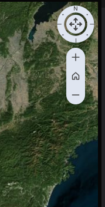
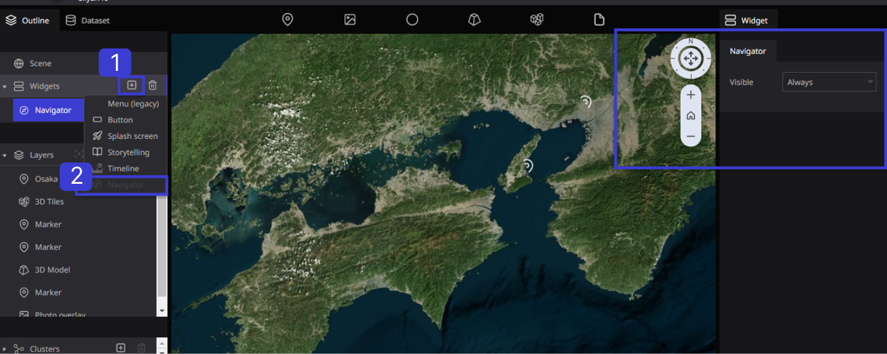
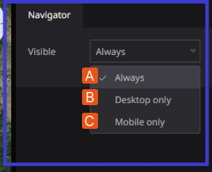
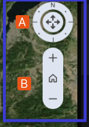

# Navigator

**Navigator** in the Re-Earth App is a tool designed to help users explore and navigate through the virtual world of the application. It is essentially a map or a guide that provides users with an overview of the virtual environment and allows them to move from one location to another easily.

The Navigator typically displays a bird's-eye view of the virtual world, with various icons and markers indicating the location of key features and destinations. Users can zoom in and out of the map to get a better sense of their surroundings, and they can also click on specific locations to instantly navigate to them.

The Navigator can be particularly useful in the Re-Earth App, which is designed to simulate a sustainable city and features a variety of interconnected buildings, streets, and green spaces. Navigator allows users to quickly and easily navigate through this complex environment.

## How to set up Navigator in the Re-Earth App

Click on `widgets` from the outline tab in the left panel, then from the `+ icon`, click on `navigator`.

In the Re-Earth App, Navigator is the last property of the `Widget.`

Once you Select Navigator from the Widget, The Navigator Function will appear on the Right side of the screen in the Re-Earth App.

## Navigator Property

The right panel of the screen displays the properties of **Navigator** in the **Re-Earth App.** The **Navigator** Property is related to **Timeline** Properties.

**Visible:** This Navigator property displays its functions in the following ways: **Always, Desktop Only, and Mobile Only.**

**Always:** Shows the Visibility of the **Navigator** on Both Desktops and Mobile.

**Desktop Only**: this Shows the visibility of **Navigator** in Desktop Mood

**Mobile Only:** This Shows the Visibility of **Navigator** in the Mobile Mood

## Details of Navigator function

**A.** The arrow buttons in the center of the screen allow you to move the globe **up, down, left, right, or right.** You can also move the globe **east, west, north, south, and west** by operating the direction buttons.

**B.** By clicking the `'+ and - '` buttons, you can zoom in and out of the globe.