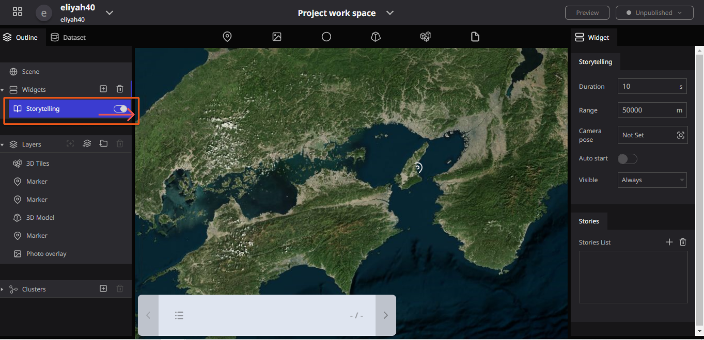

# Storytelling

Storytelling is the Third property of Widgets, which allows Users to navigate through specific layers in your project in a chosen order.

## Enable storytelling

Click on the Plus sign (**+**) in the left corner of the Re-Earth project Workspace, then select **Storytelling** to Enable it.

**To Start Storytelling**

Clicking on **Storytelling** in the widgets section of the left panel will make the storytelling settings toggle appear on the right panel. Click the Enable toggle to start using storytelling.

### Function of Storytelling

Two main parts that make up Storytelling Functionalities are “**Storytelling”** and “**Stories”.**

**Storytelling** contains the following properties: **Duration, Range, Camera pose, Auto Start,** and **Visible.**

Stories are where you can add the Stories list, which can be done by clicking the plus sign( +) in the Stories section.

### Properties of Storytelling and Stories.

The following are **properties of Storytelling and Stories**

**Duration:** is one of the functions of Storytelling in the **Re-Earth App,** Users can determine the Length and time of their storytelling using Duration. 

Overall, the concept of duration in the **Re-Earth App** is essential for measuring and understanding the passage of time, whether it is in the context of a specific project or in the broader scope of the universe.

**Range:** specify the distance from the layer to the camera. It also Specifies the distance from the specified point to the camera.

**Camera pose:** it is one of the essential parts of **Storytelling** which has the following functions: 

### How to use the Camera Pose

Specify the position of the camera. Click on the **Not Set** column next to the camera to open the camera position setting window. Enter a numerical value or adjust the camera position on the digital earth and click **Capture** to specify the camera position.

**Auto start:** When turned on, the storytelling feature will start from the first item when the project is Launched.

**Visible:** Users can select the visibility of **Storytelling** in different formats such as **Always, Desktop only, and Mobile only**

## Stories

This is the setting where users can choose which layers will be shown and in what order while using storytelling.

Click on the **+ sign** in the  Stories List to add a list of Storytelling that will be displayed once the Project is launched.

Once the **Layer selection** is Opened, Select the **Layers** you want to display as **storytelling** from the selectable layers box, Then Click on **Add** to Add the Layer to the **Stories box**

From the Output, you can see that **3D Tiles** have been added to the **Stories** List in the Stories Box.

### Illustration of Setting up  Storytelling in the Stories Box

### Camera settings per item

The camera angle of view and camera position during storytelling can be set for each item.

Please select the item you have added to the stories list to set up the Camera view.

- **Duration:** Specify the time (in seconds) it takes to move between layers.
- **Range:** Specify the distance from the specified point to the camera.
- **Camera:** Click the `Not Set` column next to the camera to open the camera position setting window. Enter a numerical value or adjust the camera position on the digital earth and click `Capture` to specify the camera position.

### Performing Storytelling

For projects with the storytelling feature enabled, a storytelling menu will appear in the lower-left corner of the screen.

Use the `> buttons` to move to the next layer and the `< buttons` to move to the previous layer. 

In the storytelling function, an info box appears at the same time you move layers.

Click on the select icon on the left of the storytelling menu to display the story list. 

You can also directly select and move the corresponding layer from here.

NOTE: **This function can start functioning after you set it up and then preview or publish your project**

### Illustration of Performing Storytelling

