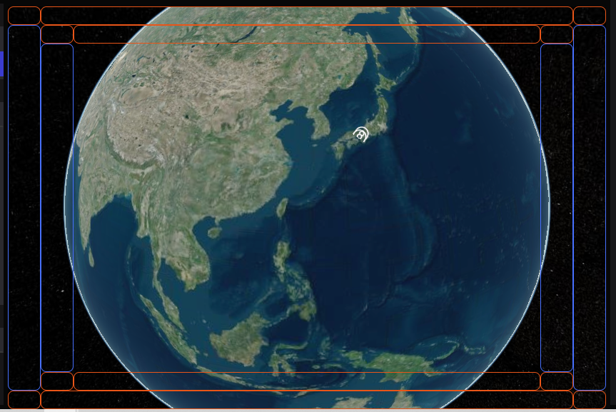

# The idea of align system

## Overview.

The alignment system is a grid-like layout that allows widgets to be moved to different parts of the screen. This allows you to customize the characteristics of your scenes and markers, as well as make the way your project looks more flexible.

Widgets are placed in a default location when activated. This is the best location for the widget, but if you want to make your project unique with a special layout, for example by combining several widgets in one corner, you can use the alignment system.

