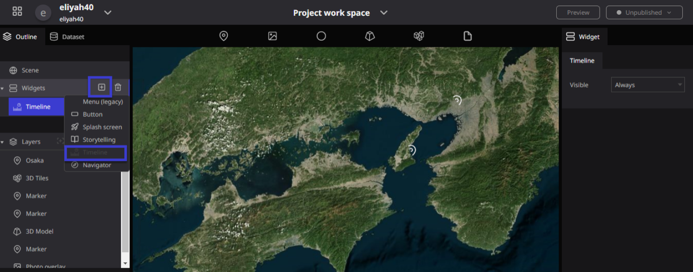
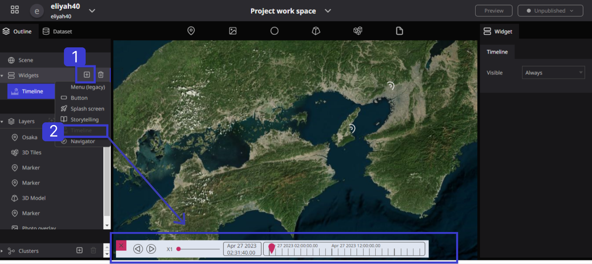
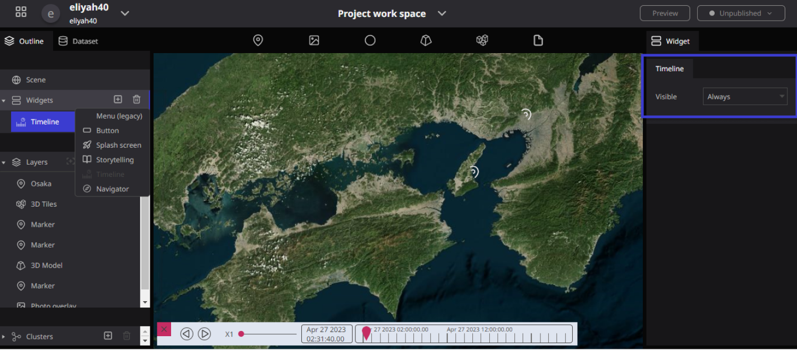
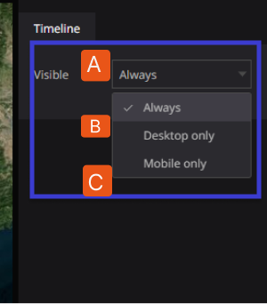
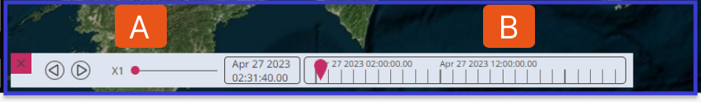

# Timeline

**Timeline** is a feature that switches the display of data according to time.

The timeline feature helps you analyze and understand geospatial data more effectively. It also makes it easier to understand temporal patterns related to specific areas or points on the globe.

## How to set up Timeline

Click on `widgets` from the outline tab in the left panel of the Re-Earth App, then click on the `+ icon`, And select `timeline`.

once you select Timeline, A timeline will appear in the lower-left corner of the screen.

## Timeline Properties

The timeline has only one property which is Visible. The right panel of the screen displays a settings window related to the timeline.

### Visible Functions

Once you select Timeline from Widget, you will see the Timeline properties on the right upper side of the workspace screen in the Re-Earth App.

**Visible:** This Timeline property displays functions in the following ways: **Always, Desktop Only, and Mobile Only.**

**Always:** Shows the Visibility of the **Timeline** on Both Desktops and Mobile.

**Desktop Only**: this Shows the visibility of **Timeline** in Desktop Mood 

**Mobile Only:** This Shows the Visibility of **Timeline** in Mobile Mood

## Details of Timeline Display function

**A.** Controls the speed at which time passes.

**B.** Is a scroll bar that can be used to specify a specific time range. The slider also allows you to easily change the time range displayed on the map.

 