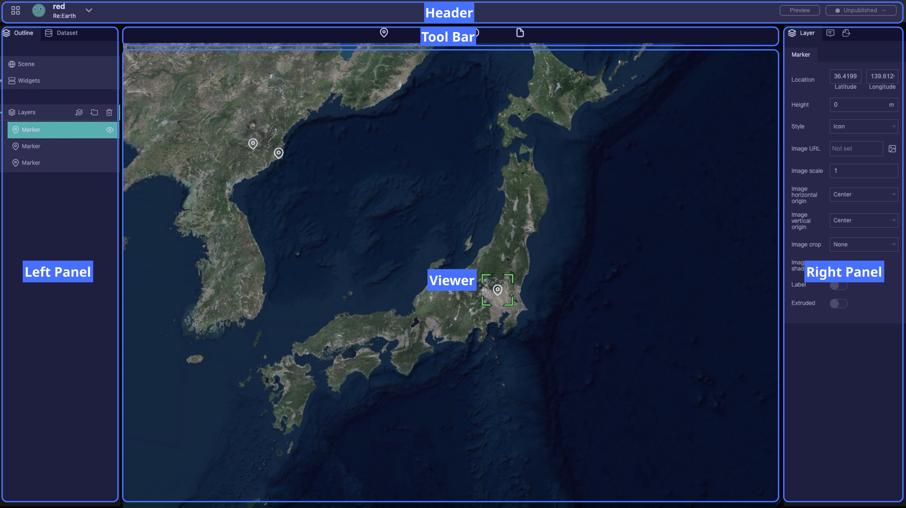
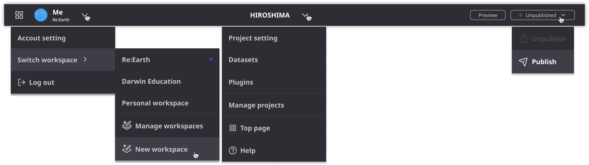
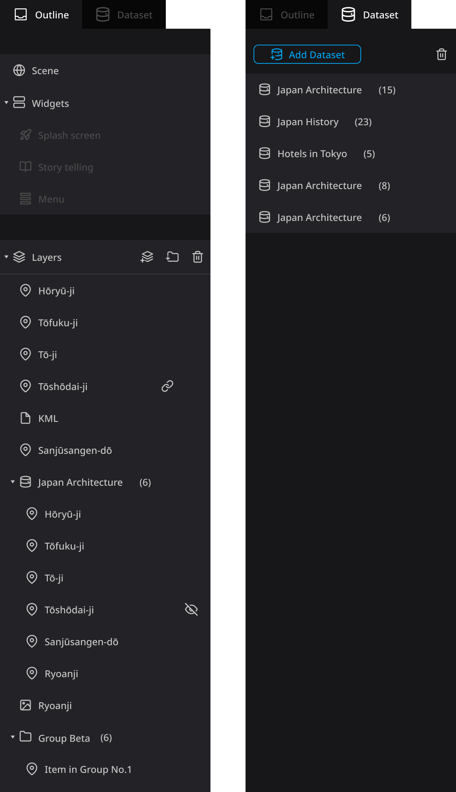
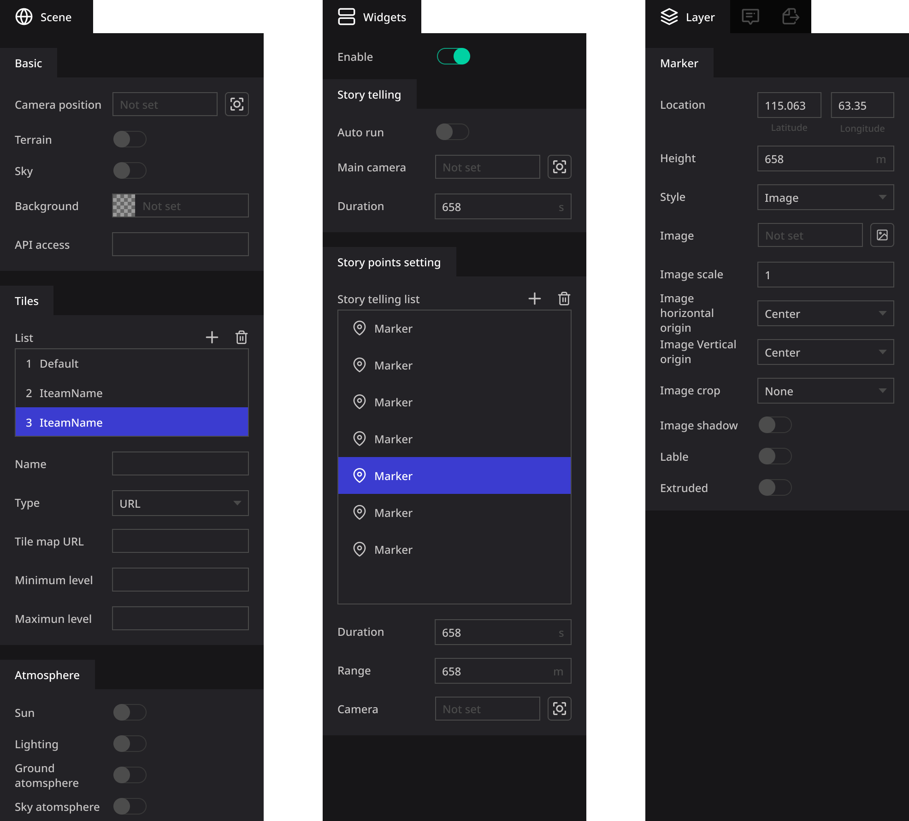

# **Editor**

The edit page is the main screen for editing projects. We aim to be as simple and straightforward as possible.

As you can see, the Editor Page is made up of five EDITOR AREAS:

- **Header**
- **Tool Bar**
- **Left Panel**
- **Viewer**
- **Right Panel**

As a basic configuration, the left panel is the content list. Used to select objects for manipulation.

The right panel is the properties panel for the selected layer. Used to change properties.

The viewer, located in the center, is the viewing window for your project. You can also select and edit layers.

## **Header**

In the header, you can navigate, create workspaces and projects, and make public settings for projects.

The down arrow will open a menu. Through these menu you can complete various operations, as well as navigating to various setting pages. The two buttons on the right are used to quickly preview or publish the project, respectively. 

Click ∨ next to the account name or project name to display the menu.

The preview and publish status buttons in the upper right are used to quickly preview or publish your project. See also [here](https://www.notion.so/2646199634aa49eaa4be6cb0ff23eb3a?pvs=21) for publishing features.

## **Left Panel **

The Left Panel is used to present and manage all the content contained in the project. It has two labels **Outline** and **Dataset**

### **Outline**

Outlines primarily manage scenes, widgets, and layers.

 - If you select 'Scene', you can change the settings related to the scene. For details, please refer to How to set the scene.
 - Select 'Widgets' to view and manage settings for splash screens, storytelling, menu buttons, and project plugins.
 - 'Layers' allows you to check and manage all layers in the project.

### **Dataset**

 The Dataset label is used to manage the Dataset in the project. You can add or delete a Dataset. 

## **Tool Bar **

The toolbar provides a basic set of operations. "Marker", "Photo overlay", "Sphere", "3D model", "3D tile" and "File" can be added to the project as new layers.

### **Right Panel**

The right panel displays properties corresponding to the item selected in the left panel.

### **Viewer**

The viewer located in the center of the screen is the area for displaying and operating the Digital Earth. It is used for various operations such as editing info boxes, camera settings, previewing projects, etc.

Re: Earth currently uses the Cesium engine by default.

### Basic operations of the viewer :

- Pan view: left click + drag
- Zoom view: right click + drag, or scroll with mouse wheel
- Free rotation of digital earth: mouse wheel click+drag or CTRL+left click+drag