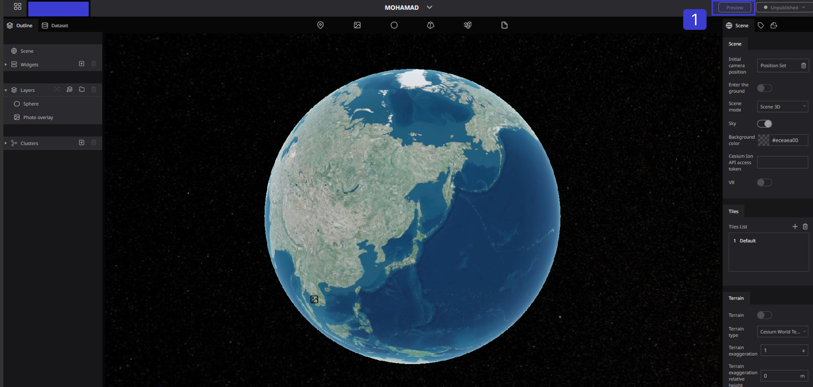
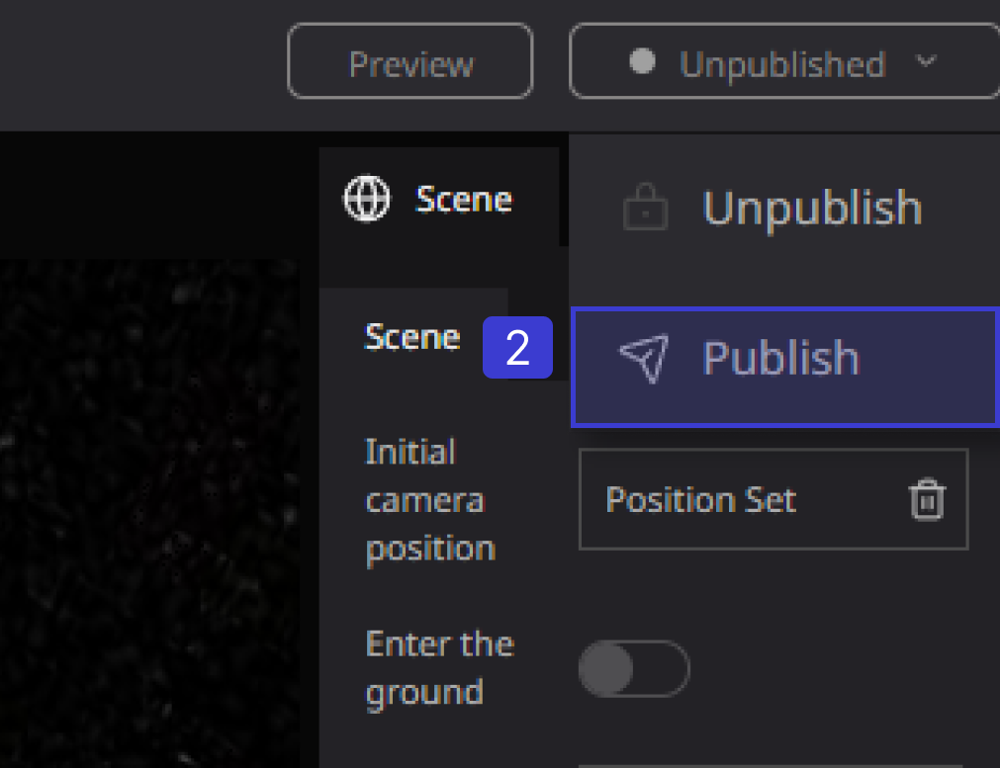
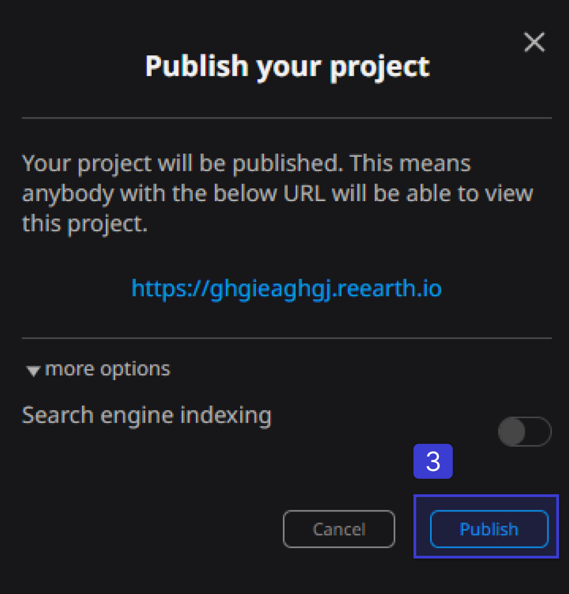
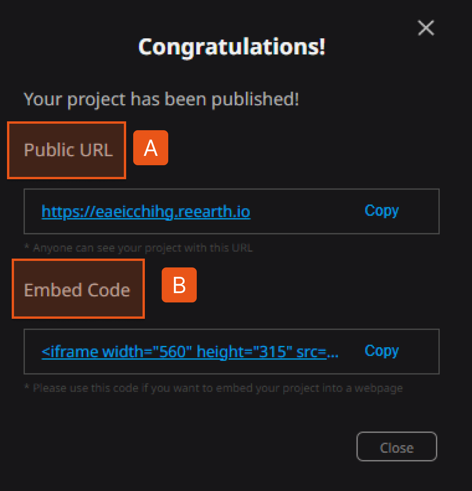
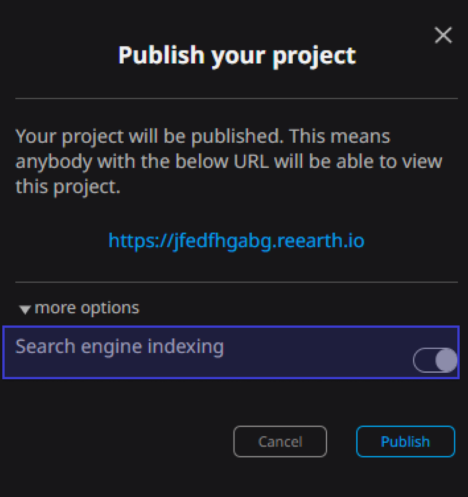

# Publish Page

## public page

### Publish your project

1. Click the publish menu on the top right of the project edit screen.

1. Select Publish.
    
    
    

1. A confirmation screen will appear in the center of the screen. Click Publish.
    
    
    
    
    

A. `Public URL`: Anyone on the internet with the link can view it.

B. `Embed Code`: Use the embed code to embed your project on other websites.

## Make your project appear in Google search results

On the confirmation screen at the time of publication, by turning on the toggle button of Searchable from other settings, it will be possible to display it in Google search results.

