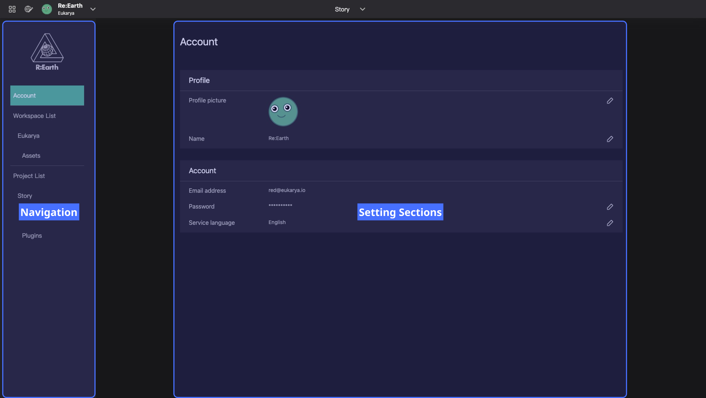

# **Setting page**

The Settings page is where the users can manage all account, workspace and project settings.

- **Navigation**: Select a setting item.
- **Settings Sections** : You can check and change the settings for the selected item.