# Info box properties

The following is the list of properties that users can use to customize the **“infobox”.**

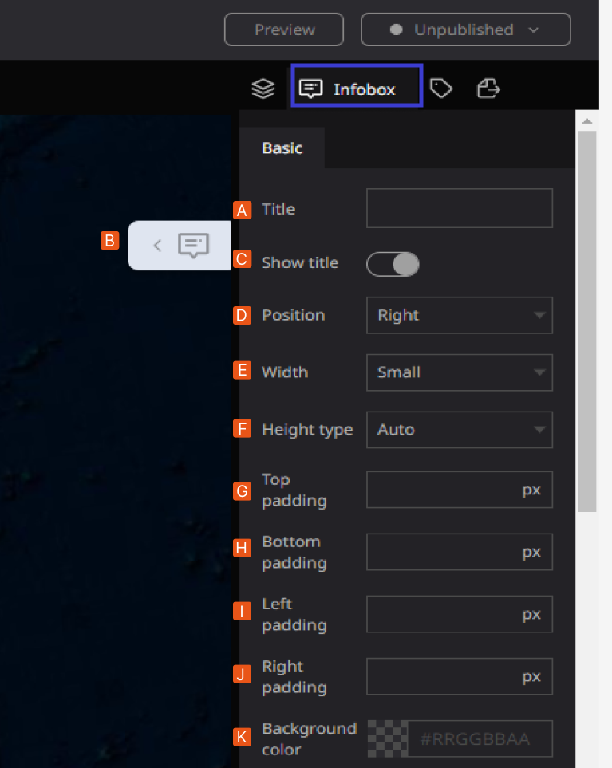

- **A: Title:** Allows users to decide the title of the infobox in the Re-Earth App.
- B: **Marker:** In Re-earth App, markers can take on different forms, such as **Text, Image Video Location, Table, and HTML**. They can be positioned anywhere in the scene of the Re-Earth App and can be associated with other objects, such as buildings, roads, or trees.
- **C: show Tittle:** with the show title option users can select to display or hide the title for the title display.
- **D: Position:** users can adjust the display position (right/center/left) of the infobox in the Re-Earth App.

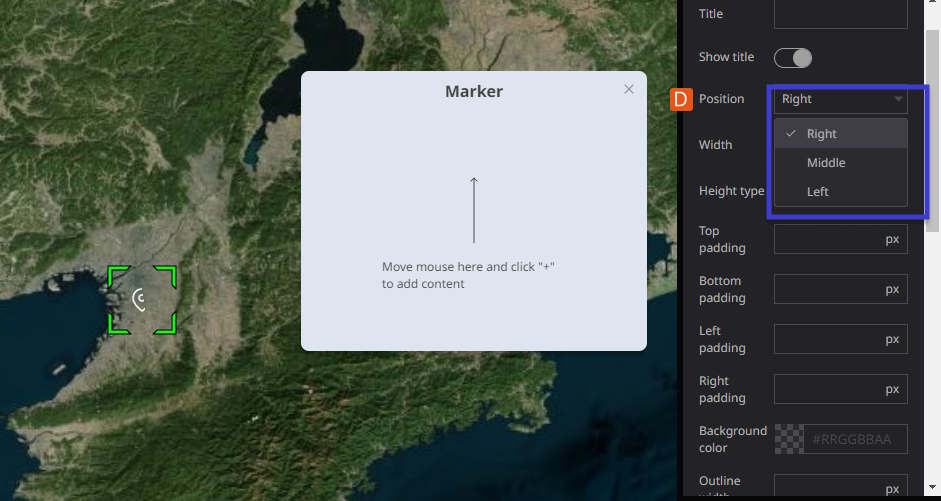

- **E: Width:** Users can adjust the size of the infobox in **(small/medium/large)** using **Width.** The **width property** allows users to adjust the size of the infobox in the Re-Earth app. It provides three predefined options: **"small," "medium," and "large."**

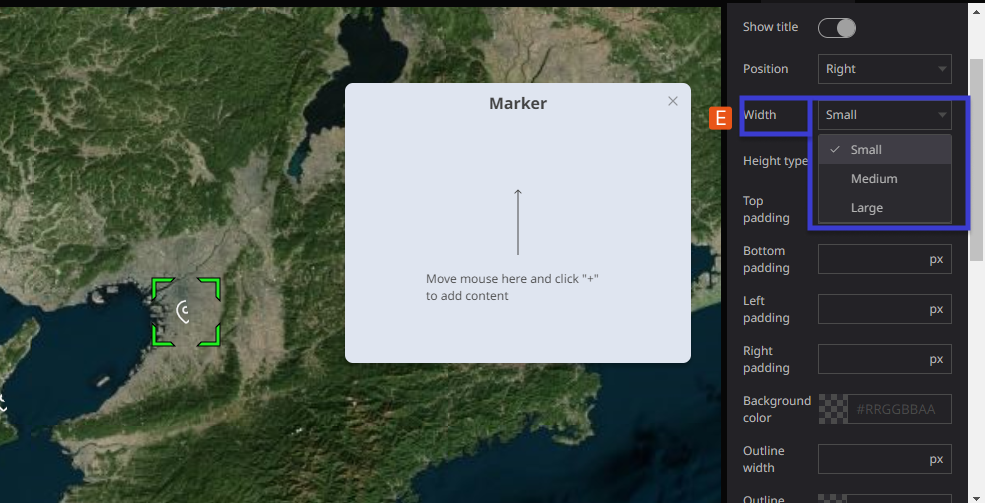

### The width allows you to change the size of the infobox.

- **Small:** Selecting the "small" option sets the width of the infobox to a smaller size, suitable for displaying concise information or when you want to conserve space on the screen.
- **Medium:** Choosing the "medium" option sets the width of the infobox to a moderate size, which strikes a balance between compactness and readability. This option is ideal for displaying a moderate amount of content within the infobox.
- **Large:** Opting for the "large" option sets the width of the infobox to a wider size, allowing for the display of more extensive content. This option is useful when you have more detailed information to present or when you want to prioritize readability.

**Small**

**Large**

- **F: Height type:-**  The height type can adjust the display size of the infobox using **auto/manual. The** **height type** property allows you to adjust the display size of the infobox in the Re-Earth app. This property provides two options: **"auto" and "manual."**
- **Auto:** Selecting the "auto" option for the height type will automatically adjust the height of the infobox based on its content. This ensures that the infobox expands or contracts dynamically to fit the information it contains. It is a convenient option when you have varying amounts of content within different infoboxes, as it optimizes the display to avoid unnecessary empty space or content truncation.
- **Manual:** Choosing the "manual" option for the height type allows you to manually specify a fixed height for the infobox. This means you can define a specific height value in pixels or any other appropriate unit of measurement. With the manual setting, the infobox will maintain a consistent height regardless of its content. This option provides more control over the visual layout of the infoboxes if you prefer a consistent size throughout your app.

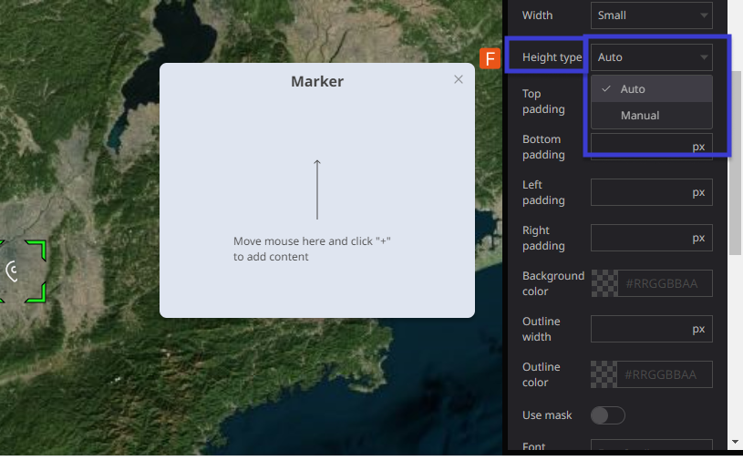

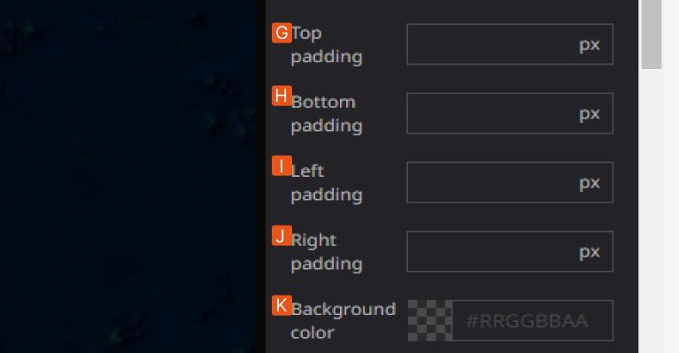

- **G: Top Padding** is adjustable when the Height setting is set to Manual.
- (The Top Padding range: 0~40px)
- **H: Bottom padding**  is adjustable when the Height setting is set to Manual.
- (the **Bottom padding** range: 0~40px)
- **I: Left padding** is adjustable when Height setting is set to Manual.
- **(Left padding** range: 0~40px)
- **J: Right padding** is adjustable when Height setting is set to Manual.
- (The **Right padding** range: 0~40px)
- 
- **K: Background Color**: Allows users to decide the color of the infobox. Users can also adjust the transparency of the background.

**The background color property** allows users to customize the color of the infobox in the Re-Earth app. Users can select a specific color from a palette or enter a custom color value.

- **Color Selection:** Users can choose a color from a predefined palette of colors. The palette may include a range of options such as primary colors, secondary colors, or a variety of shades and tones.
- **Custom Color:** Users also have the option to enter a custom color value using a color picker or by manually specifying the color in hexadecimal, RGB, or HSL format. This allows for greater flexibility in matching the infobox color with the overall app theme or specific design requirements.

**Transparency:** In addition to choosing the background color, users can adjust the transparency of the infobox background. This property controls the opacity of the background color, allowing users to make it more or less transparent.

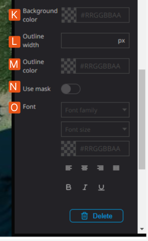

- **L: Outline width:**- You can adjust the thickness of the infobox frame line using outline width. The outline width property allows you to adjust the thickness or width of the frame line surrounding the infobox. This property controls the visual appearance of the infobox border and lets you customize the outline to match the overall design or style of your app. By adjusting the outline width, you can make the infobox frame line thicker or thinner, providing visual emphasis or subtlety to the infobox content.

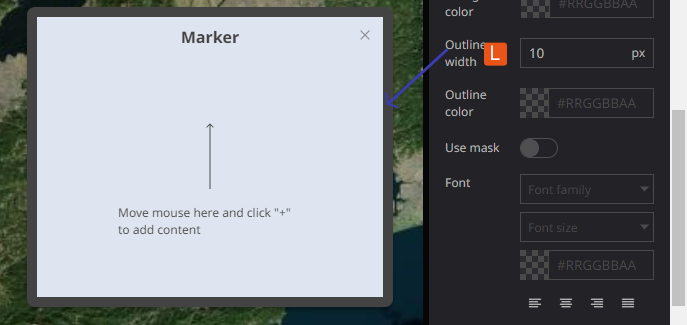

**M:** **Outline color:** The **outline color property** in the Re-Earth app allows users to change the color of the infobox border. Users can select a specific color from a predefined palette or enter a custom color value.

- **Color Selection:** Users can choose a color from a range of predefined options provided in a color palette. The palette may include various colors, shades, and tones to accommodate different design preferences.
- **Custom Color:** Alternatively, users have the flexibility to enter a custom color value using a color picker or by manually specifying the color in hexadecimal, RGB, or HSL format. This allows for precise control over the outline color, enabling users to match it with the overall design scheme or specific branding requirements.

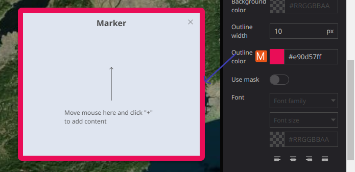

By offering the outline color property, the Re-Earth app empowers users to customize the appearance of infoboxes and make them visually distinctive. This feature allows users to highlight or coordinate the infobox border with other elements in the app, enhancing the overall aesthetics and user experience.

- **N: Use Mask:-** The "Use Mask" property in the Re-Earth app allows users to enhance the visibility and focus on the infobox by darkening the background map and highlighting the infobox itself.

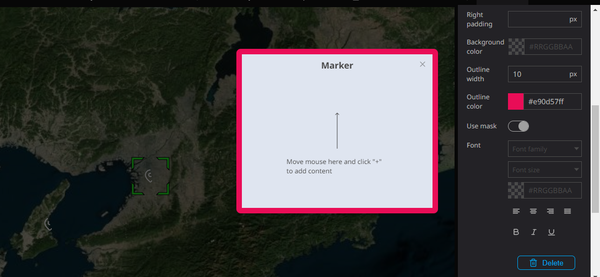

**When the "Use Mask" option is turned on for an infobox, the following effects can be observed:**

- **Darkened Background:** The background map behind the infobox is dimmed or darkened, creating a contrast that helps draw attention to the infobox content. This technique reduces distractions from the surrounding map elements and directs the user's focus towards the information presented in the infobox.
- **Infobox Highlight:** The infobox is visually highlighted, making it stand out from the rest of the map. This can be achieved by adjusting the brightness, saturation, or color contrast of the infobox, giving it a more prominent appearance.
    
    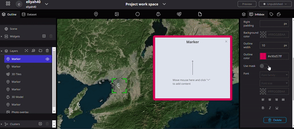
    

- **O: Font:- This Property** Allows users to decide the **font size, typeface, and color.** As well as text **alignment and toggling bold, italic, and underline settings** for all text in the infobox.

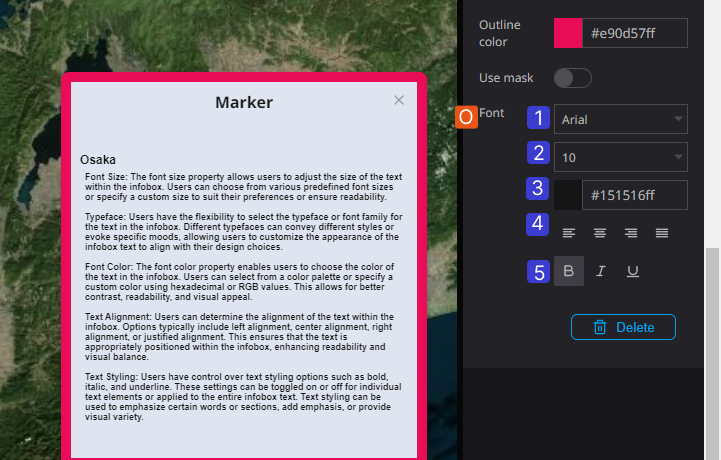

1. **Font Size:** The font size property allows users to adjust the size of the text within the infobox. Users can choose from various predefined font sizes or specify a custom size to suit their preferences or ensure readability.
2. **Typeface:** Users have the flexibility to select the typeface or font family for the text in the infobox. Different typefaces can convey different styles or evoke specific moods, allowing users to customize the appearance of the infobox text to align with their design choices.
3. **Font Color:** The font color property enables users to choose the color of the text in the infobox. Users can select from a color palette or specify a custom color using hexadecimal or RGB values. This allows for better contrast, readability, and visual appeal.
4. **Text Alignment:** Users can determine the alignment of the text within the infobox. Options typically include left alignment, center alignment, right alignment, or justified alignment. This ensures that the text is appropriately positioned within the infobox, enhancing readability and visual balance.
5. **Text Styling:** Users have control over text styling options such as bold, italic, and underline. These settings can be toggled on or off for individual text elements or applied to the entire infobox text. Text styling can be used to emphasize certain words or sections, add emphasis, or provide visual variety.

### Illustration of the Front Property:

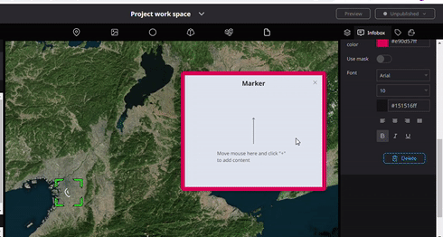
