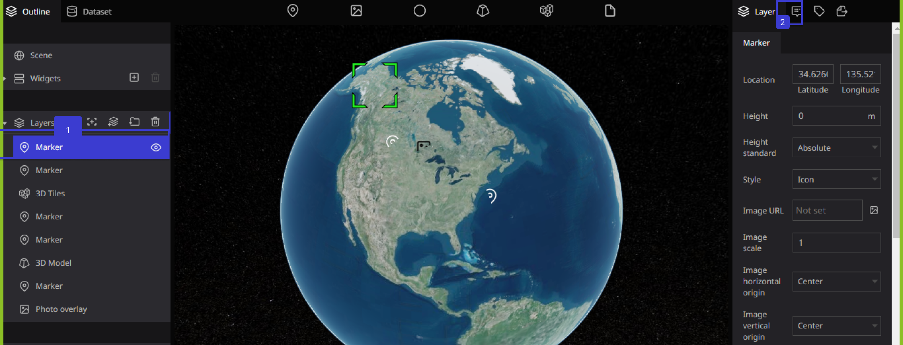
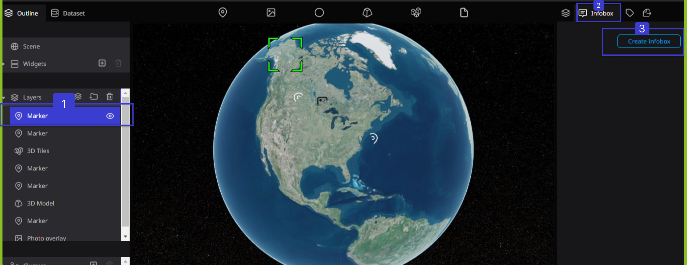
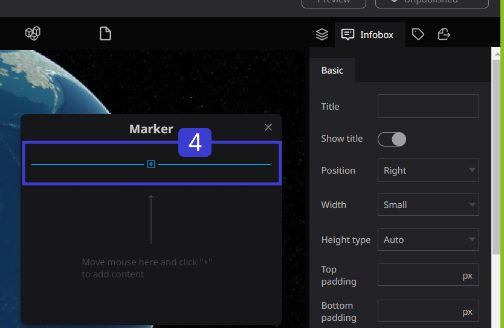
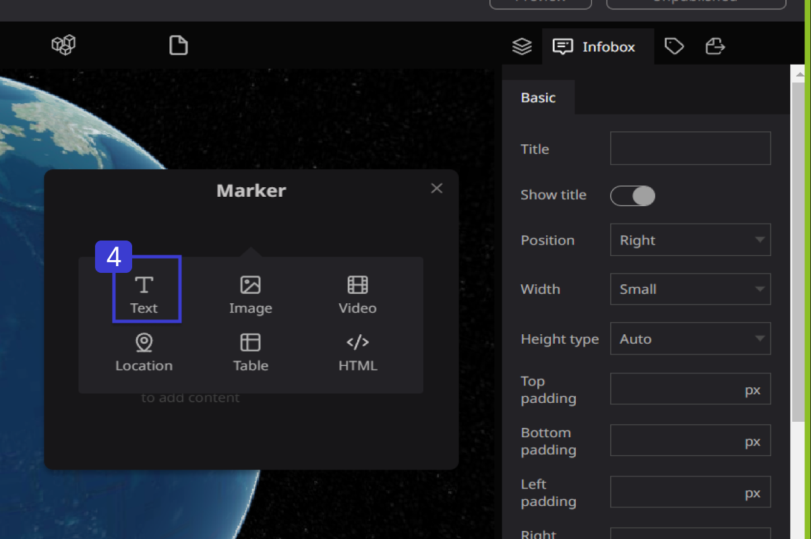
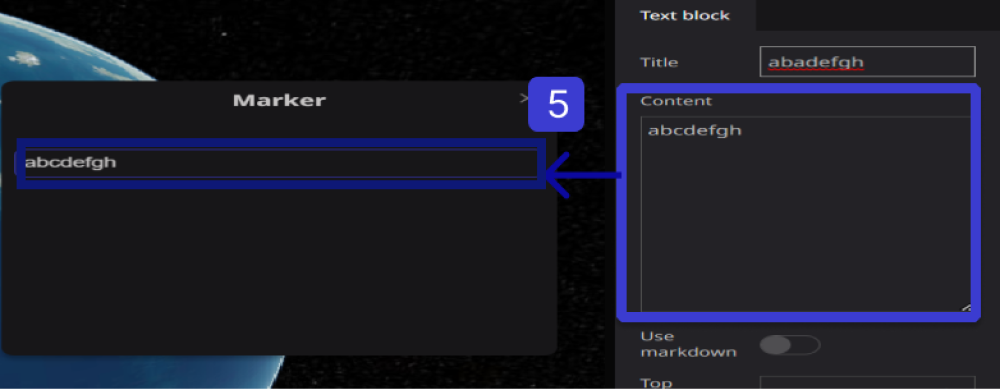
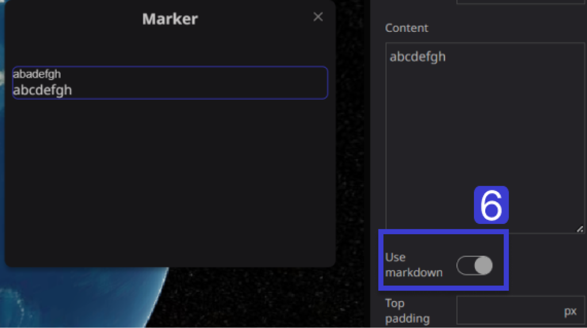
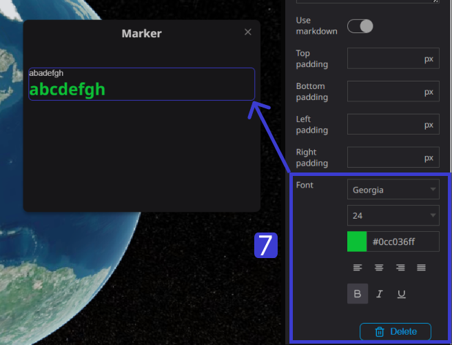

# Text Block

A text block is a tool used for creating sentences within an info box. A text block is a versatile tool used for creating sentences, paragraphs, or any textual content within an info box in the Re-Earth App. It allows users to add informative text, descriptions, instructions, or any other relevant information to enhance the understanding of the displayed data or map features.

### How to Create A Text Layer On the Re-Earth App

**Step 1.** Choose the Marker you want to add text to from the left panel, then click the infobox.

**Step 2.** Choose the Infobox tab on the right panel.

**Step 3**. Click "Create Infobox".

**Step 4.** When you hover over the Info Box, a "+" symbol will appear. Click on the "+" sign and select "Text".

**Step 5.** Add a title if necessary, then add your text content to the InfoBox.

**Step 6.** If you want to add text using Markdown syntax, you can do it by turning on Markdown mode.

> Markdown is a lightweight markup language that allows you to specify document structure using simple syntax such as "# heading" and "* list". It can be converted into decorated HTML documents.
> 

**Step 7.** You can adjust the font of the text, including the font type, size, color, position, and boldness. 

Additionally, you can adjust the title font by using the same procedure.

