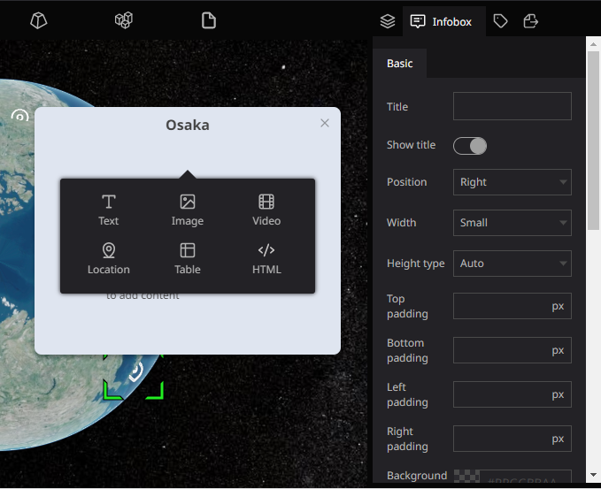
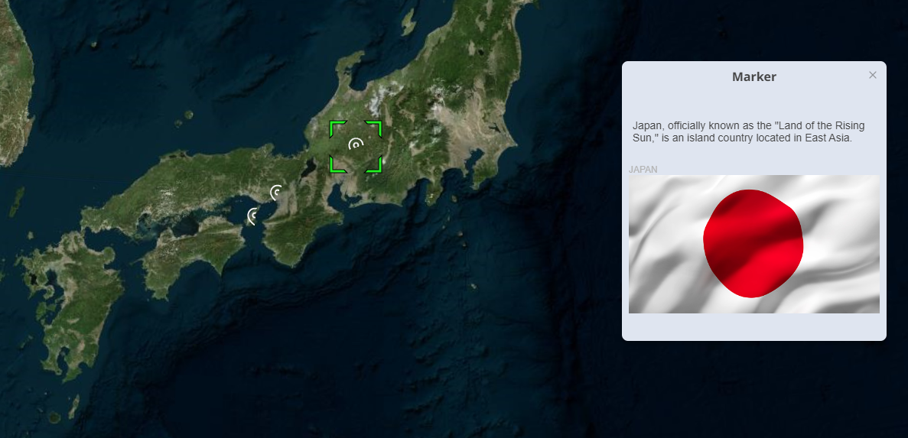
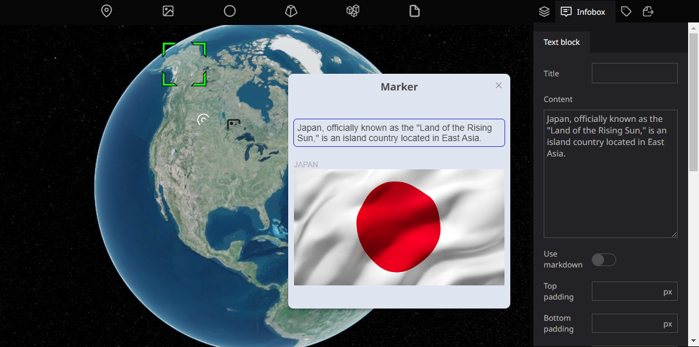

# Overview

An infobox is a box that can appear when a viewer clicks on a layer on the map.

infobox in the Re-Earth app is a powerful tool that enables users to provide more detailed and engaging information about specific locations or objects within their digital twin projects. By using Infobox, users can create more immersive and informative digital twin experiences for their audiences.

Infoboxes can be added to digital twin scenes and customized to include various types of information and media. Infoboxes in the Re-Earth app are typically associated with markers, which are used to identify and highlight specific, such as text, images, videos, links, and HTML.

The typeface and format specified in the infobox settings will be inherited by each block unless otherwise specified in respective settings.

By setting up an infobox, you can attach detailed information to the layer.

The text and images to be inserted in the infobox will be managed by blocks.

