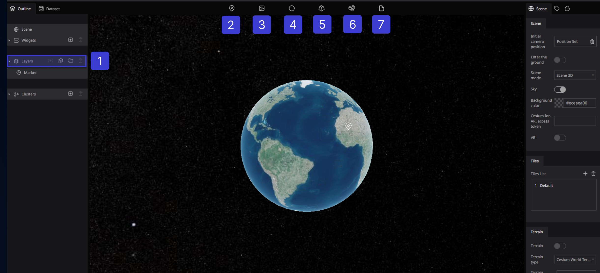

# Overview

Layer is the tool we use to manage all content which displayed in the Scene. It has the similar idea in other projects.
In Re:Earth, we can add layers to the map. And also objects that can be rendered on the digital earth

Everything is layers.

## Re:Earth layers type

- Marker
- Photo overlay
- Sphere
- 3D Model
- 3D Tiles
- File