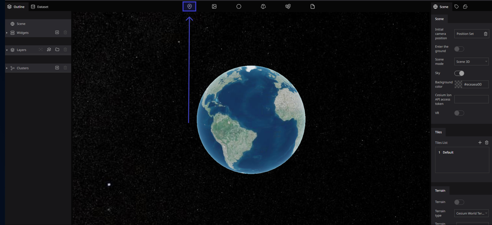
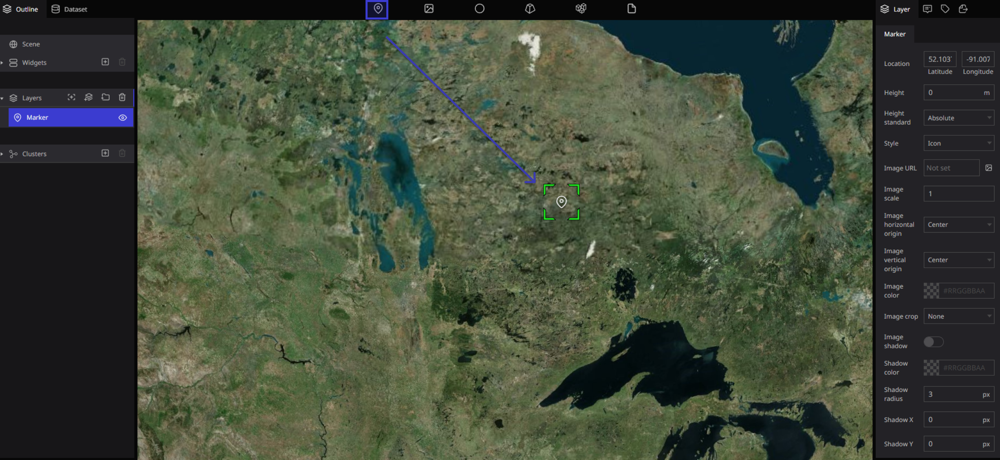
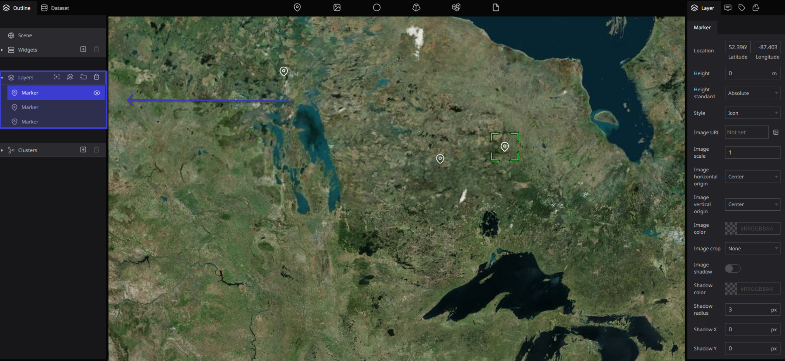
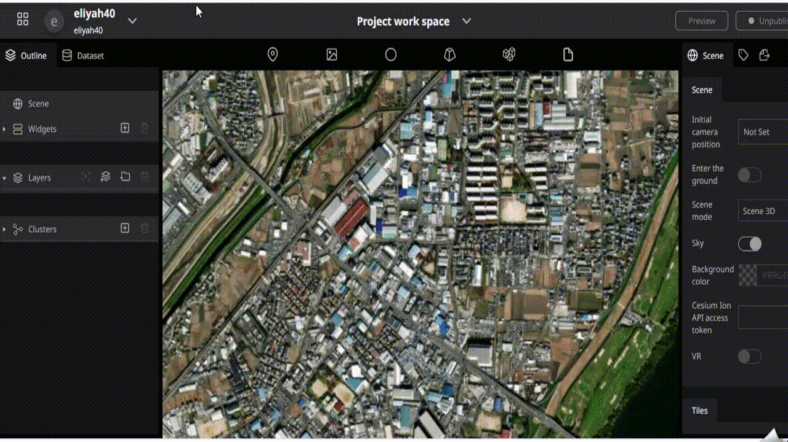
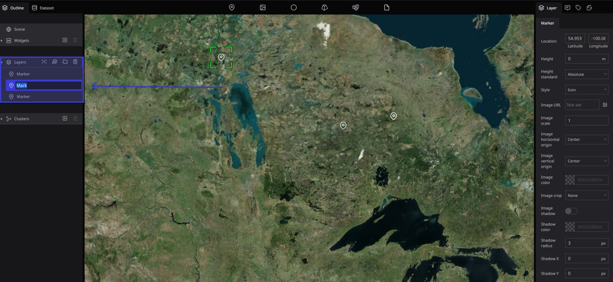
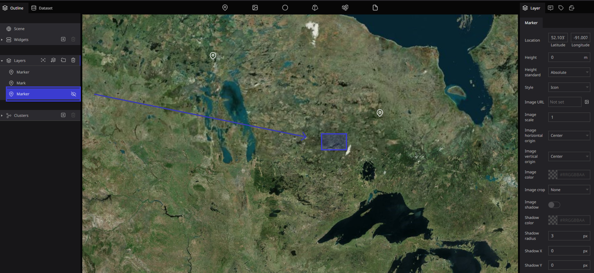
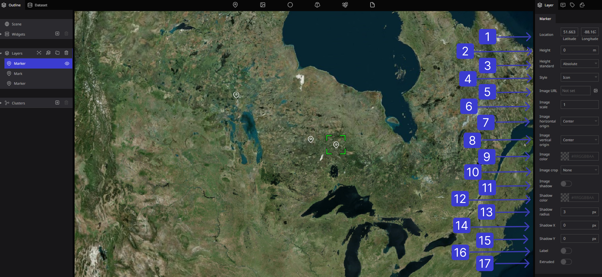
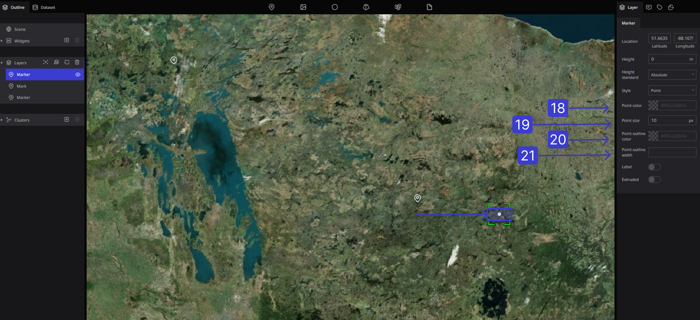
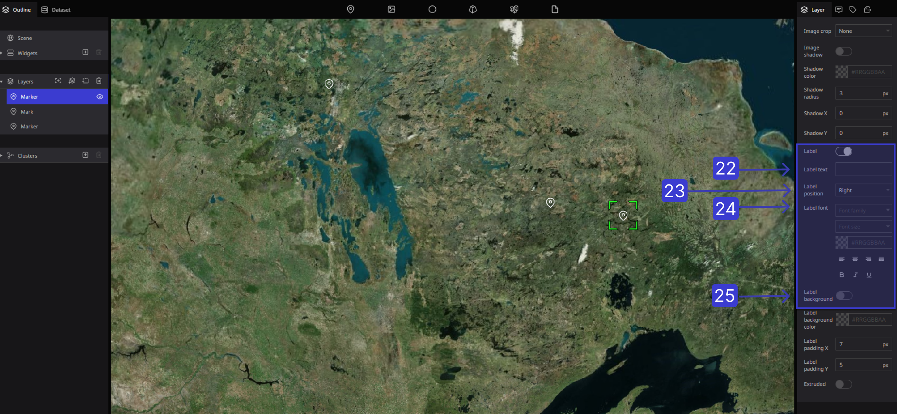

# Marker

## Overview

### What is the marker

This function is used when you want to pinpoint a position on the globe.

The Marker is the leftmost icon of the six functions on the toolbar.

## How to use markers

### Add Marker

Drag the marker icon to the desired position and drop it to drop the marker on the earth.

When the marker is dropped on the earth, the text of the marker written in blue is displayed in the "layer" on the left side of the screen. This is the icon of the marker that you drop on the globe. Also, as you drop the point of the marker, the number of markers will increase in the layer.

### Creating Marker illustration

### Renaming Markers

You can change the name by double-clicking on the marker character in the layer.

### Hide Marker Icons

If you click the eye mark on the right side of the marker on the left side of the screen, the icon on the globe will disappear.

## Reposition marker

Move the mouse to the marker icon on the earth, hold down the left click until it becomes a hand shape, and drag it as it is to change the position.

### Delete Marker

Click the marker you want to delete in "Layer" on the left side of the screen, select it in blue, and press the "Trash " can mark to delete it.

.png)

## Marker Properties

The following items can be set in the marker properties.

1.  **Position**: Sets the position of the marker.

2.  **Altitude**: Sets the altitude above the ground of the marker.

3.  Altitude standard: You can select from "default", "fixed to ground", and "height above ground". If "Default" is selected, the absolute height from the WGS84 ellipsoid (digital earth). "Fixed to the ground" and "Height from the ground" will be different from "Default" only when the "Terrain" setting is enabled in the scene.

4. Display method: Select from points or icons. For points, you can set the color and size (setting details are explained below), and for icons, you can set the image, size, and placement.

5.  Image URL: When you upload an image, the icon changes to the selected image.

6. Image size: You can set the size of the image.

7. Horizontal center of image: You can set the center of the image from "Center", "Left", and "Right" of the selected range.

8. Image center vertical: You can set the center of the image from "Center", "Top", "Bottom", and "Baseline" of the selected range.

9. Image color: You can change the image color and icon color.

10. Crop: You can display the image as it is or crops it around.

11. Image shadow: Add a shadow to the image icon. When set to ON, shadow setting items are displayed.

12. Image shadow color: You can set the shadow color.

13. Shadow radius of image: You can set the size of the shadow.

14. Image shadow X: You can set the vertical position of the shadow.

15. Image shadow Y: You can set the horizontal position of the shadow.

16.  Label: You can attach a label to the marker. If you have attached a label, you can make detailed settings for the label. (explained below)

17. Extend line from ground: Sets whether to draw a line between the marker and the ground surface when setting the altitude to the marker.

18. Point color: Displayed when a point is selected. Sets the color of the points.

19. Point size: Displayed when a point is selected. Sets the point size.

20. Line color of points: Displayed when a point is selected. You can set the color of the edge around the point.

21. Width of point line: Displayed when a point is selected. You can set the width of the edge around the point.

22. Label text: Enter the name for icons, dots, and images.

23. Label position: You can set the position of the label for the icon, etc.

24. Label font: You can set the label font, size, color, etc.

25. Label background: You can add a background to the label text.

