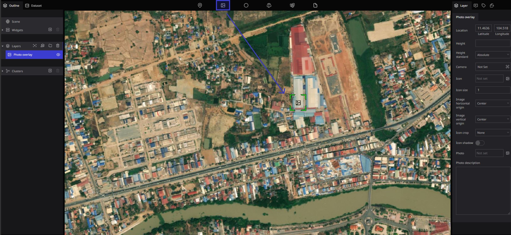
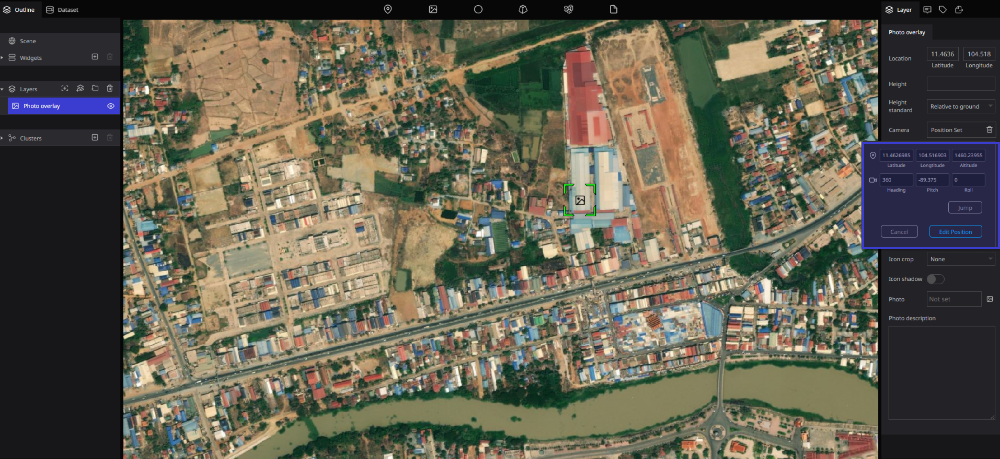
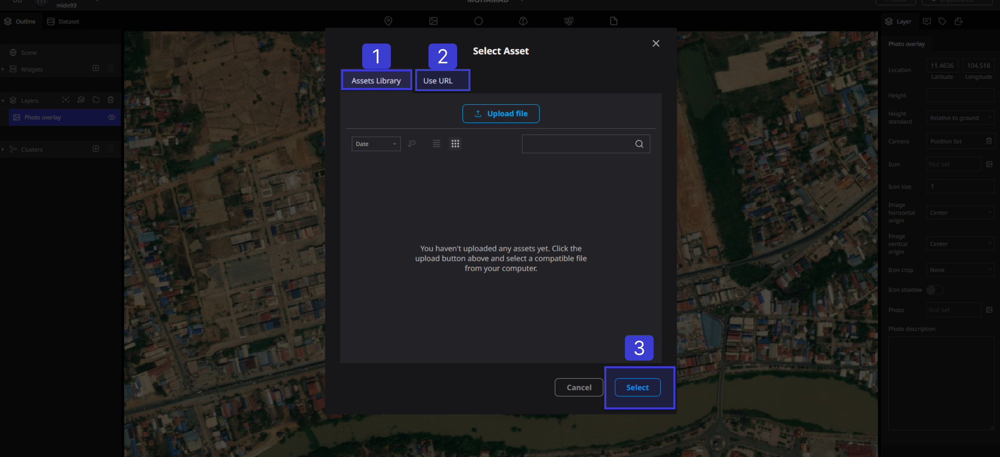
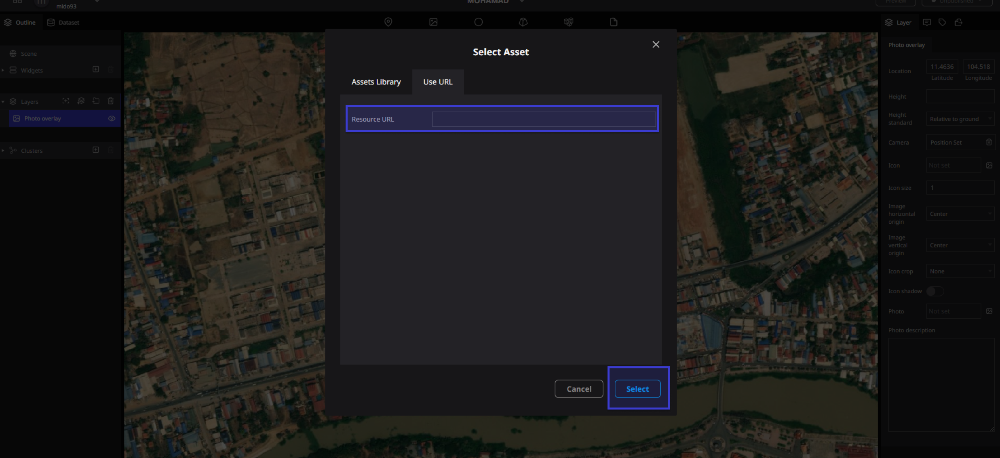
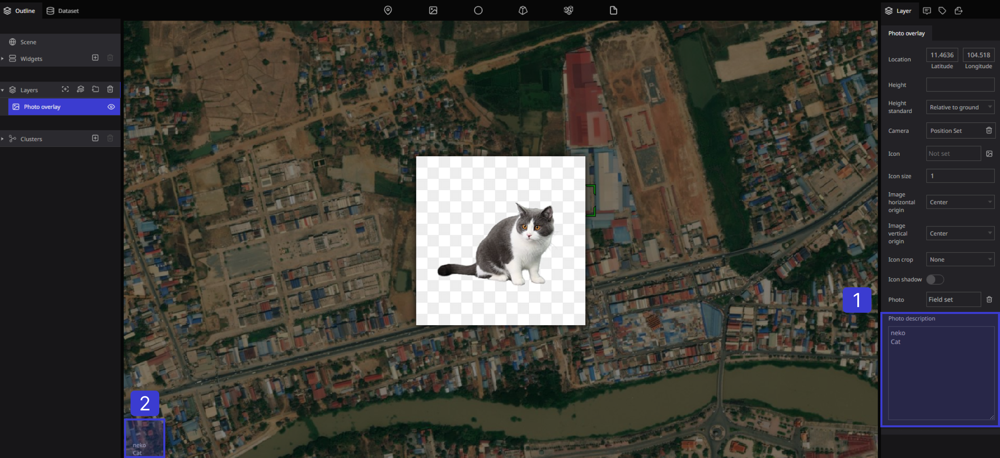

# Photo overlay

## Overview

The photo overlay function is used when you want to set the image on the full screen, while the image set with the marker can be adjusted in size.

## Usage

Drag and drop the photo overlay mark to any location.

A new "Photo Overlay" item is added to the layer column on the left, and when a blue band is attached, the layer setting screen is displayed on the right side of the screen.

.png)

## Properties

.png)

**①** **Position**: You can set the location of the photo overlay by latitude and longitude

**②** **Altitude**: You can set the height of the photo overlay

**③** **Altitude reference**: You can set the reference position for the height (select from default, fixed to the ground, altitude from the ground)

## Camera

You can set the angle of view of the map drawn when displaying the image

Press the "Camera" button.

.png)

The camera angle of the view setting screen opens.

・You can set the detailed angle of view by entering numerical values in "Latitude/Longitude/Altitude" and "Heading/Pitch/Roll"

・When the angle of view is decided, press the "Edit" button to fix the angle of view

.png)

You can also change it by mouse operation. Press the "Camera" button to open the angle of view setting screen, and then use the mouse to set the angle of view. Finally, press the "Edit" button to fix the angle of view

## Icon style

.png)

**①** **Icon**: You can set the icon to be displayed on the map

You can select from a PC or URL

**②** **Icon size**: You can set the size of the icon

③  Icon center horizontal: You can set the horizontal origin of the icon (select from left, center, or right)

**④** **Center vertical of icon**: You can set the vertical origin of the icon (select from top, center, baseline, bottom).

**⑤** **Icon Crop**: You can set the shape of the icon (select from none or a circle)

**⑥** **Icon shadows**: You can set the presence or absence of icon shadows (select on/off)

## overlay image

Specify an image to be displayed on the map

You can select an image from the data on your computer or the URL

Press the "Overlay image" button

.png)

### Upload images

**①**　When uploading from a computer, press "Upload file" and put the image on the computer into the file.

② When uploading from a URL, enter the URL of the image in "Resource URL" and press the "Select" button to confirm.

## Overlay image description

Enter the description directly

.png)

① The description entered in 

② is displayed at the bottom of the screen.

