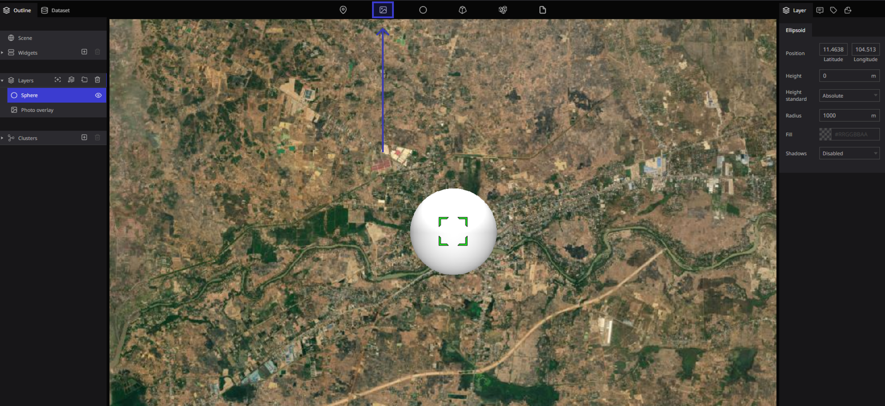

# Sphere

## What is a sphere

It is used when you want to specify a wide range at a certain point on the globe.

It's the third icon from the left in the toolbar.

## how to use sphere

1: Drag and drop the sphere icon to the place you want to specify on the globe.

2: If you want to move the dropped sphere, you can drag the sphere on the globe.

3: You can change the name by double-clicking the "sphere" in the layer on the left side of the screen.

4: If you want to delete it, select the icon you want to delete from the layers on the left side of the screen and click the "trash can" mark at the right end of the word "layer" to delete it.

5: Detailed settings such as the position of this sphere, color, size of the sphere, etc. can be set in the property "sphere" on the right side of the screen.

## Sphere tool properties

The following items can be set with the sphere tool :

- Position: Set the position to display the sphere.
- Altitude: Set the altitude to display the sphere.
- Advanced standard:
- Radius: Sets the radius of the sphere.
- Fill Color: Set the color of the sphere.
- Shadow: Enables shadows. Also, shadows in the scene should be enabled.
Rendering may become overloaded.

.png)
