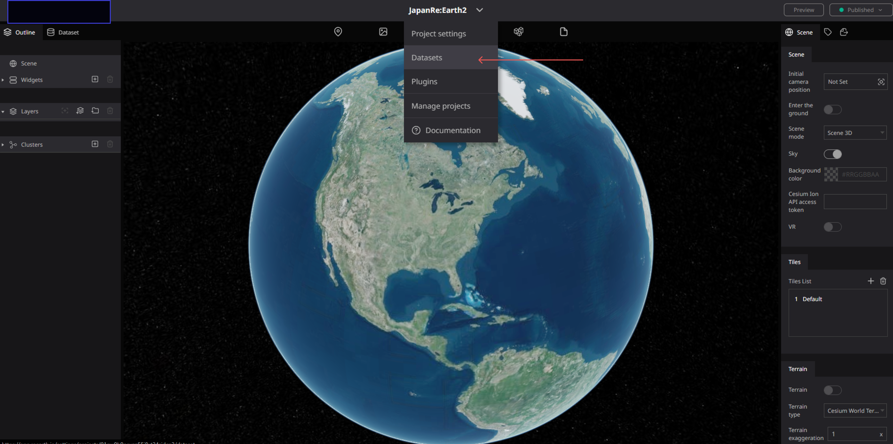
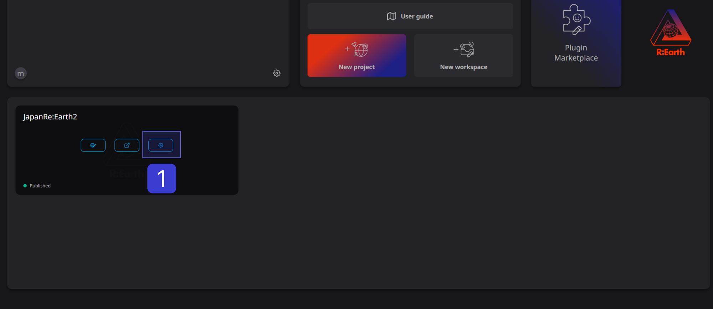
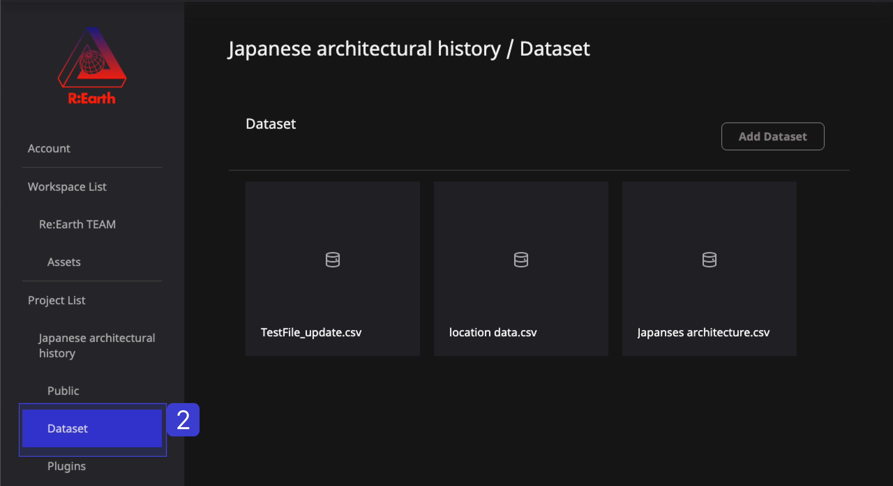
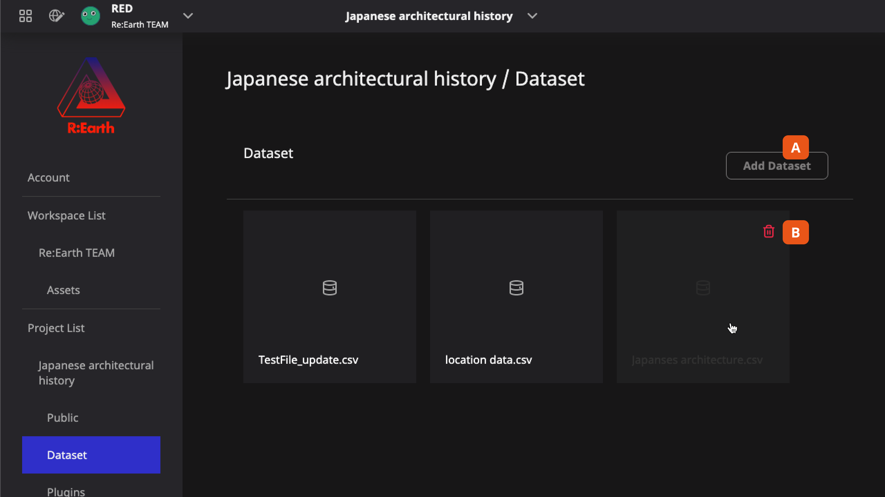

# **Dataset library**

In Re: Earth, any external data that is imported will become a dataset. This is the internal data storage form of the system. 

You can find the Dataset library here: Editor page —> Header menu —> Datasets

On this Dataset library page, found in the settings, you can see and manage all the Datasets that you imported into the current project.

(1) Click the setting button of the corresponding project in the workspace.

(2) Click Dateset settings.

## **Adding and deleting Datasets **

**A** . **Add dataset (import) button** allows you to import data from your local machine.

**B** . **Delete button** is found by hovering the mouse over the Dataset card.

At the moment, managing Datasets consists of only adding (importing) and deleting them. We will expand the functionality in future development.