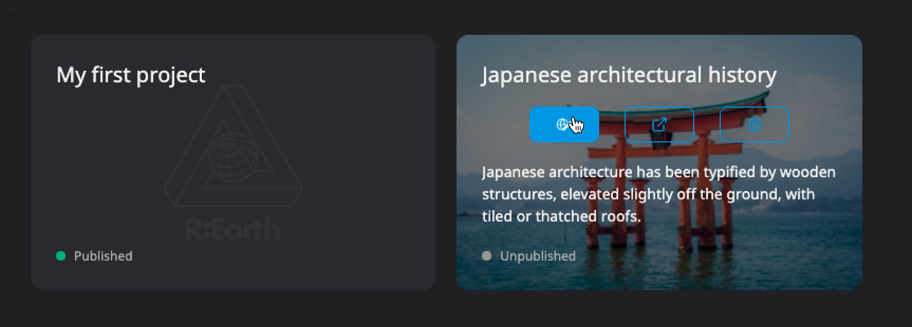
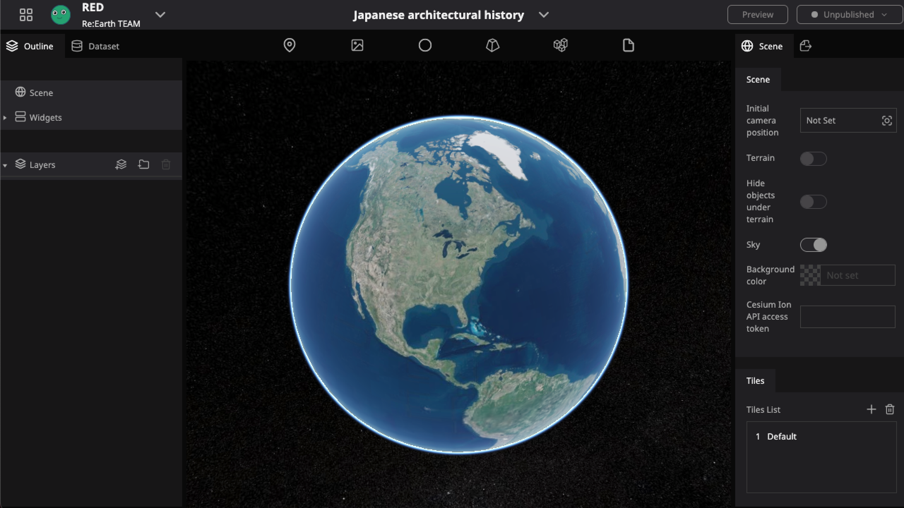
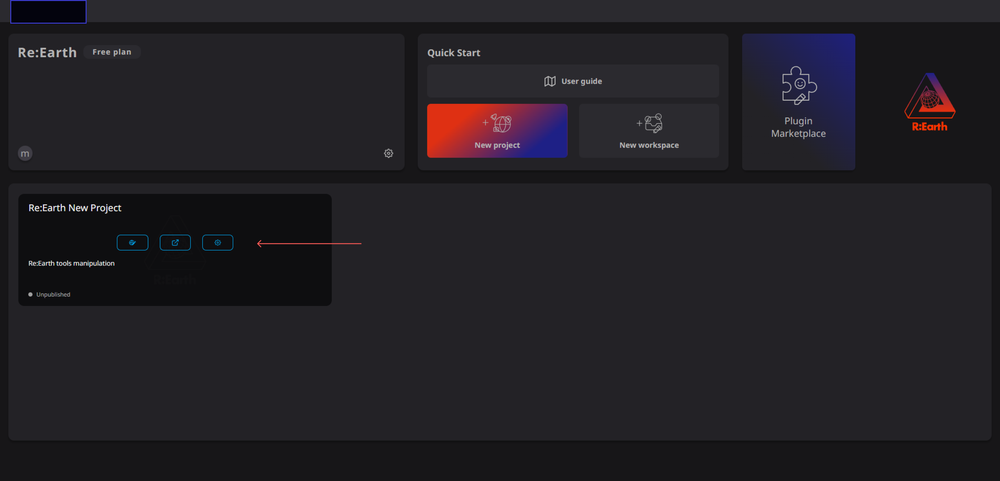
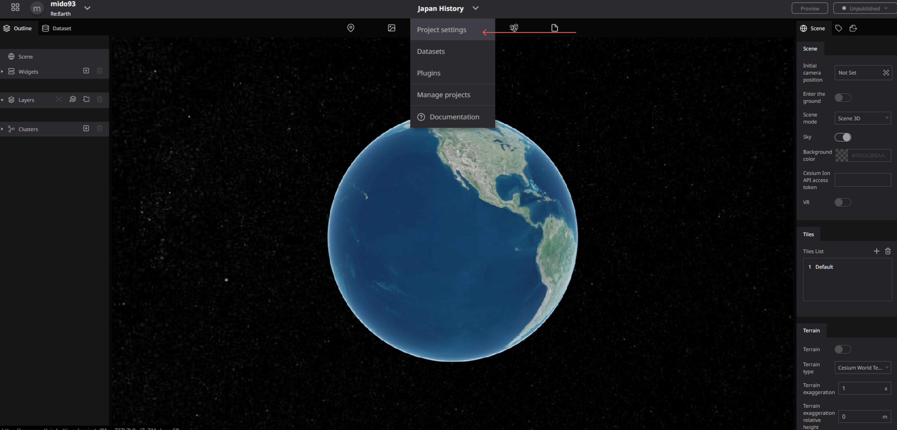
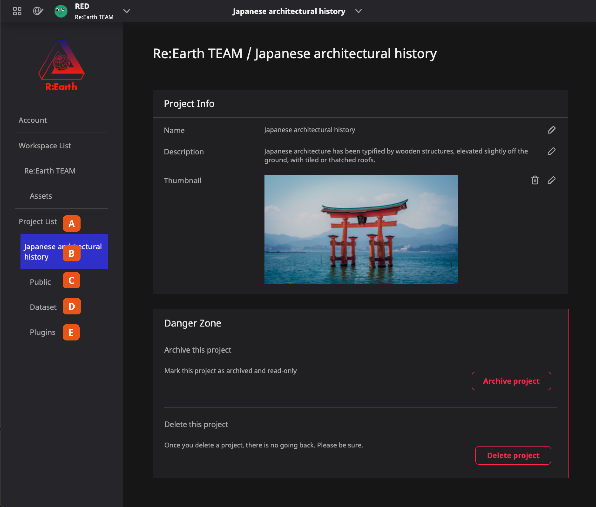
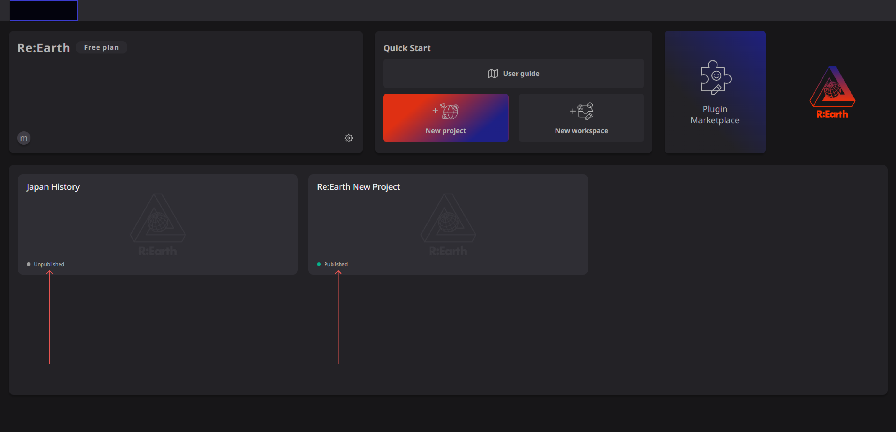
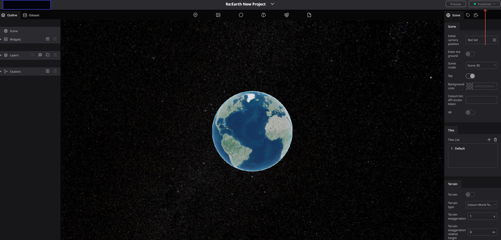

# Overview

The Project workspace is where all the magic happens in Re-Earth. Edit, publish, import your data, and more.

Once you create a project you can open the editor page and by default, you will see a digital earth floating in the universe. When a project is created, a scene will be created, attached, and used by your project. Currently, only Cesium-based scenes are available, but more will come in the future. For more information about scenes, please see the chapter on [scenes](/user-manual/project-and-workspace/scene/overview
)

As described in the previous chapters, you can add and build various content on the earth. Treat the project like an eagle,  the earth itself the canvas, and Re-Earth the set of brushes and tools to help you create your vision.

The following operations are available on a project:

- [Create](/user-manual/project-and-workspace/project/create-a-new-project )
- [Archive](/user-manual/project-and-workspace/project/settings-archiving-and-deleting)
- [Delete](/user-manual/project-and-workspace/project/settings-archiving-and-deleting)

## **Project settings page**

In the settings page, project-specific settings can be accessed where you can modify things like its title or add basic auth, manage its datasets, or the plugins used by the project.

## **Accessing settings**

There are two ways to get to a project's settings:

### **From Dashboard **

Dashboard -> Project card -> ⚙️ button

### From Editor 

Header —> Project menu —> Project settings

### **Navigation**

The navigation bar on the left allows you to access different settings related to the current project or manage all projects.

**A.** **Project list** page will display all the projects under the current workspace. Use this page to select different projects to access their individual settings.

**B.** **Current Project** page allows you to modify the basic information of the project as well as archive or delete the project. For more details, please check the [Settings, archiving, and deleting](/user-manual/project-and-workspace/project/settings-archiving-and-deleting)

**C.** **Public** settings page provides some settings about publishing your project. For more details, please check 
[Public Setting](/user-manual/project-and-workspace/project/public-settings).

**D. Dataset** library page is used to manage the datasets that have been imported into the current project. For more details, please check the [Dataset library](/user-manual/project-and-workspace/project/dataset-library) and [the Dataset section].

**E.** **Plugin** library page is used to manage the installed plugins of the current project. For more details, please check [Plugin Library](/user-manual/project-and-workspace/project/plugin-library
.md) and the entire [Plugin section].

### **Public status**

When you finish a project, you can publish it on the Internet. We have provided some signs to keep you informed of the public status of the project at all times.

### **From Dashboard**

On each project card found in the Dashboard, you can see the status.

### **From Editor**

In the upper right corner of the Editor page, you can also see and change the status at any time while editing.

### Collaborative Editing

With the workspace system, it becomes possible for team members to collaborate and edit together. Members who are in the same workspace can edit the same project. For specific instructions on how to do this, please refer to the **[Workspace](http://localhost:3000/user-manual/project-and-workspace/workspace/overview.md)** documentation.