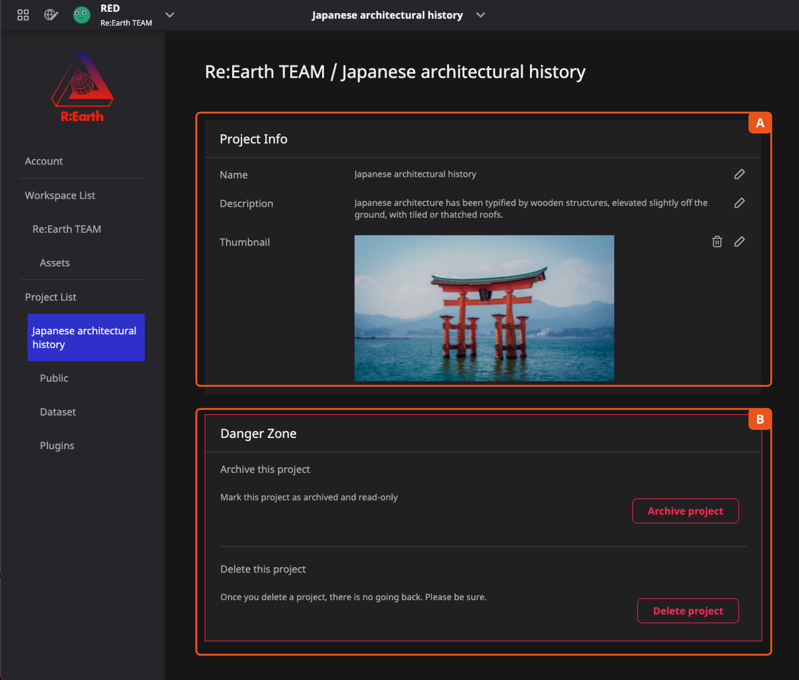
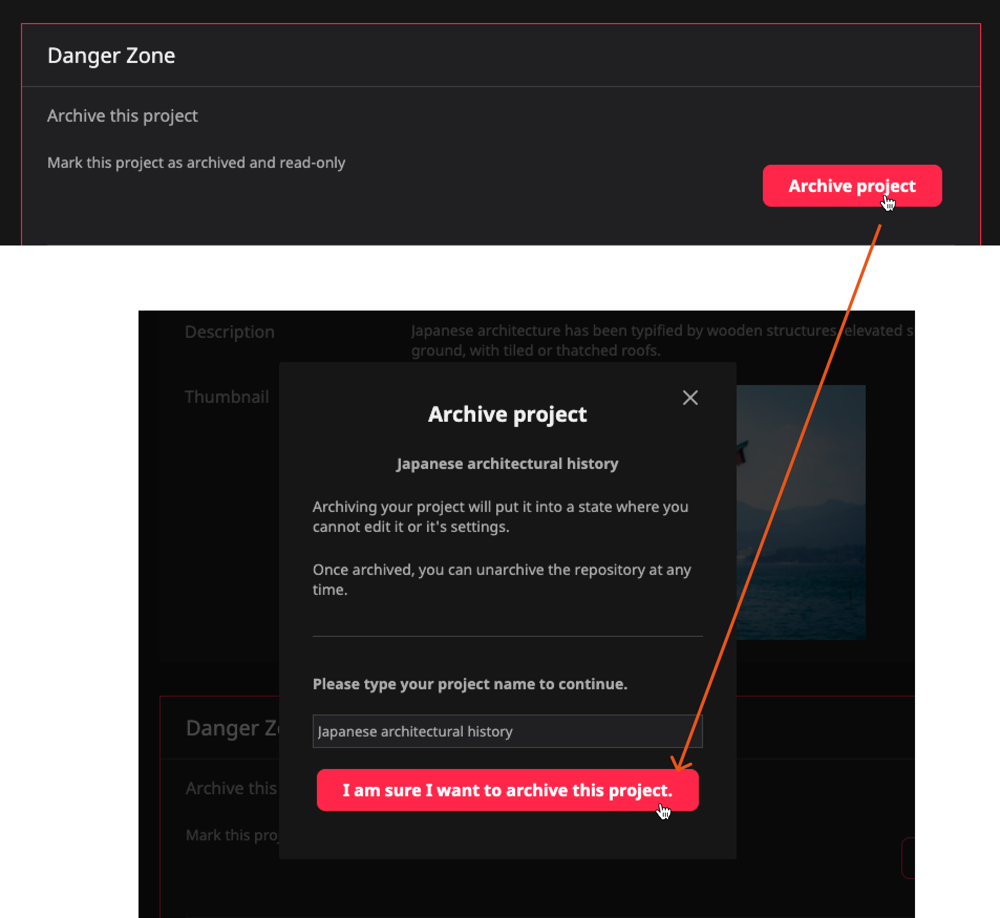
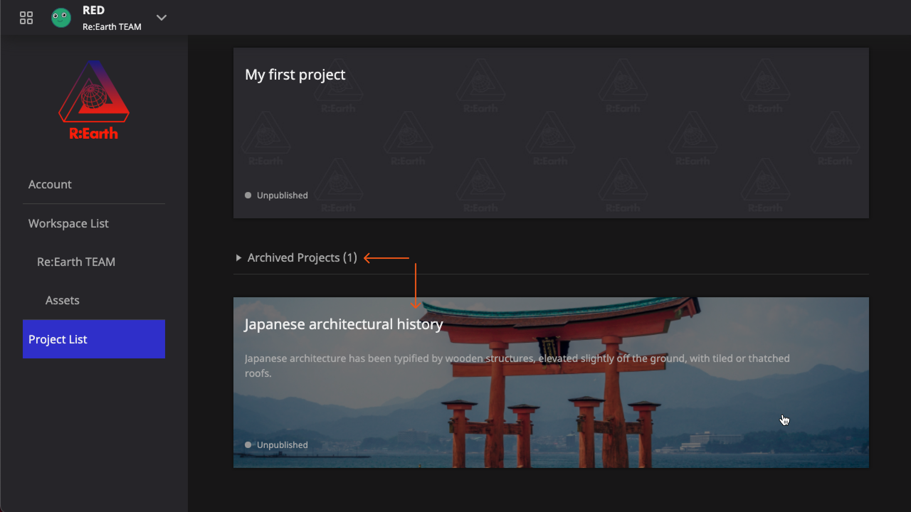
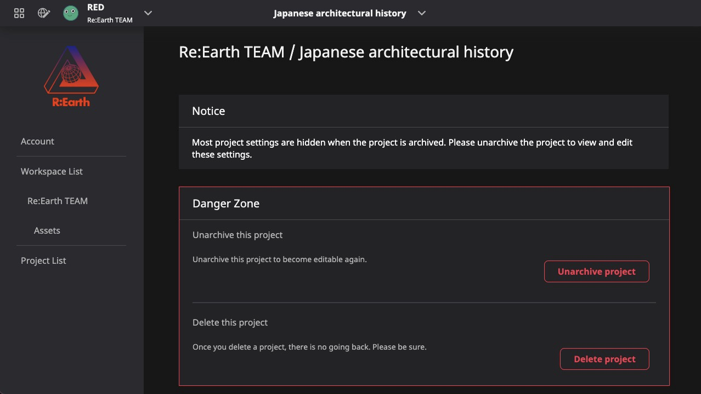
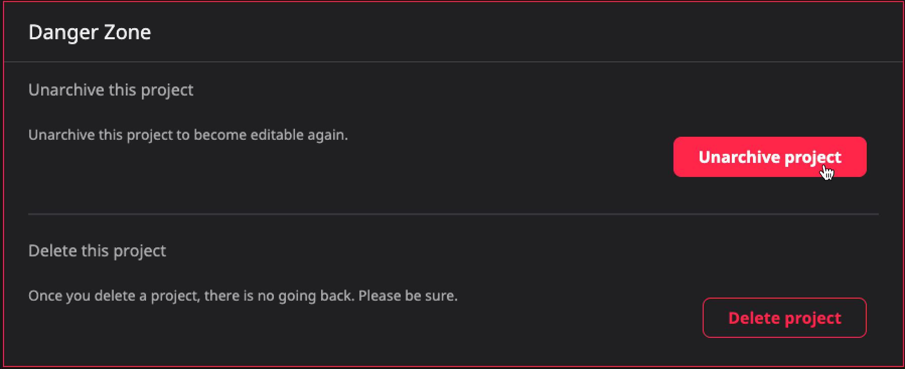
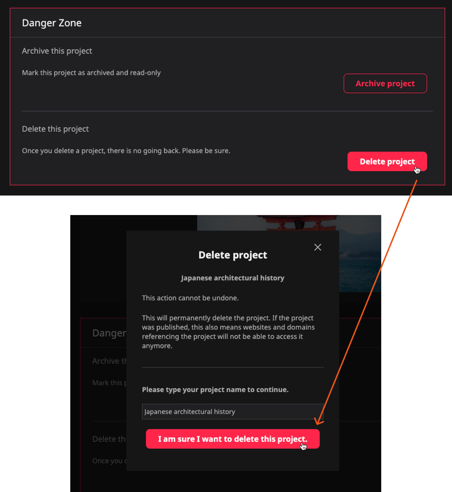

 # **Settings, archiving, and deleting**

From the current project's settings page, you can edit some basic information about the project, archive it or delete it.

**A** . **Project Info** is the basic information of the project that'll be used within Re: Earth. This information is the same content you filled in when you created the project.

**B** . **Danger Zone** contains operations that will affect the accessibility of your project. This includes archiving and deleting your project.

## Archive your project

Projects that have been completed or will not be edited for the time being can be archived. This will hide them from the Dashboard and lock editing. Published projects will stay accessible.

When you want to modify the project again, just unarchive the project from the project's settings.

## Unarchive projects

As mentioned, once the project is archived you will not be able to find it on the Dashboard. You can find all archived projects listed at the bottom of the Project list page.

Click on an archived project to go to its settings page. You'll notice that the project has been locked and cannot be modified.

If you want to edit the project again, just simply click the Unarchive button in the Danger Zone and type in the project's name.

## Deleting your project

When you find that some projects are no longer needed, you can delete them completely. For Re:Earth, deleting a project means completely removing all information and data about the project. This will include related plugins and datasets.

In the danger zone at the bottom of the setting page, you can find the Delete project button.

