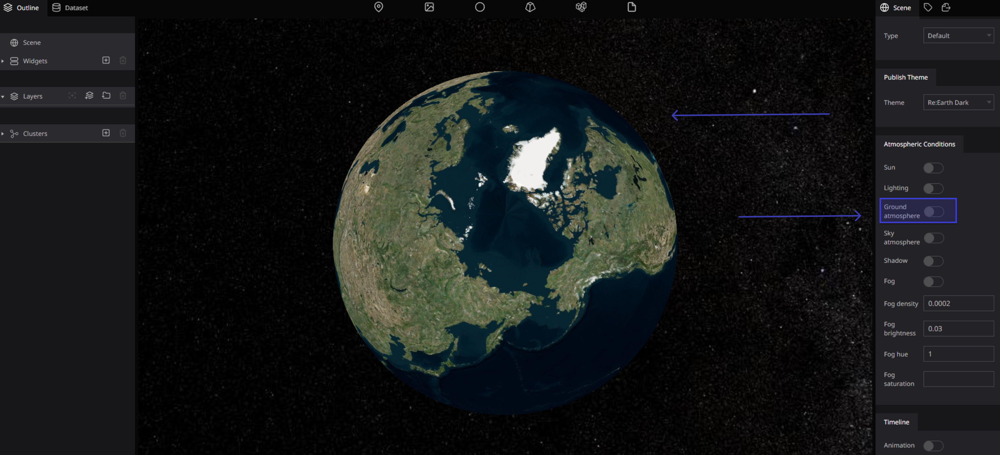

# Atmospheric Conditions

### what are Atmospheric Conditions?

the atmospheric conditions that comprise the state of the atmosphere in terms of temperature and wind and clouds and precipitation

Physical conditions in the atmosphere. Includes spatial data based on measurements, models, or a combination thereof and measurement locations. Weather conditions and their measurements; precipitation, temperature, evapotranspiration, wind speed, and direction.

### Here you can customize settings related to the atmosphere :

Sun 

Toggles between showing and hiding the sun in space.

Toggle on / with Sun 

Toggle off / No Sun 

### Lighting

Toggles between reflecting and not reflecting sunlight on the Digital Earth. This makes it possible to represent day and night by region.

Toggle on / with Lighting

Toggle off / No Lighting

### Ground atmosphere

Toggles between showing and hiding the atmosphere on the Digital Earth surface.

Toggle on / showing the atmosphere

Toggle off / hiding the atmosphere

### Sky atmosphere

Toggles between showing and hiding the atmosphere aura above the Digital Earth

Toggle on / showing the atmosphere aura

Toggle off / hiding the atmosphere aura

### Shadow

Display shadows on the Earth Shadows for each layers should be also enabled to see them.

### Fog

Toggles the fog on and off .

Toggle on / showing the fog 

Toggle off / hiding the fog 

### Fog density

Set a thickness to the fog . Min: 0 / Max : 1

Sets the fog density.

### Fog Brightness

Set brightness of the fog. Min: -1 / Max : 1

Set the brightness of the fog . 

### Fog Hue

Set hue of the fog . Min: -1 / Max : 1

Sets the color of the fog 

### Fog Saturation

Set saturation of the fog . Min: -1 / Max : 1

Sets the saturation of the fog.

