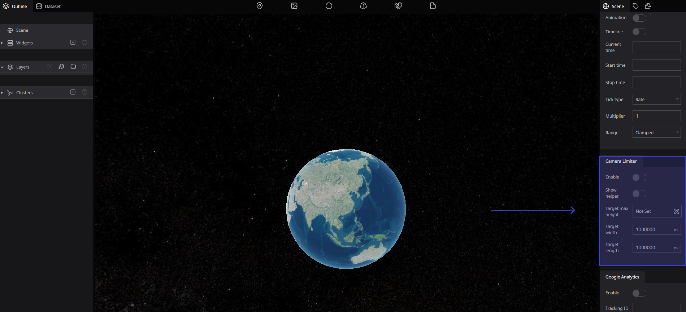
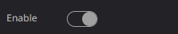
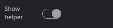
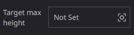
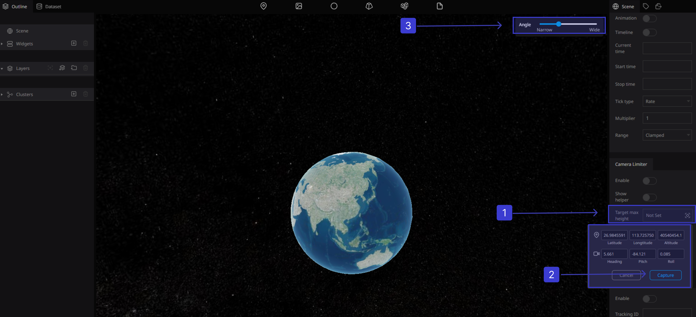
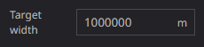
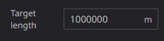

# Camera Limiter

### What is Camera Limiter?

In this guide to Camera Limiter Mode, you’ll find everything you need to master the main camera modes. This includes new features on the camera that can make things easier such as the camera program mode and other modes where you’ll have full control over your camera limiter settings 

### Here you can customize settings related to the Camera Limiter :

### Enable

Enable camera limiter

Toggles between Enable and Disable

### Show Helper

Display the limiter boundaries

### Target Max Height

the base position of the camera movement range. this position is the center

point of the limit box in the horizontal and depth directions, and is the maximum 

height of the movable range . the camera will not be able to zoom out beyond the height 

specified here

Move the digital earth to the desired location. Click (Capture) to add the coordinates that you want

### Target Width

Specifies the width longitude direction of the box that represents the limiter boundaries

### Target Length

Specifies the depth latitude direction of the box that represents the limiter boundaries

