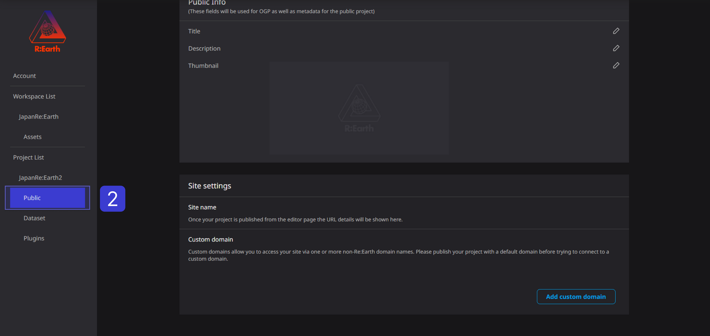
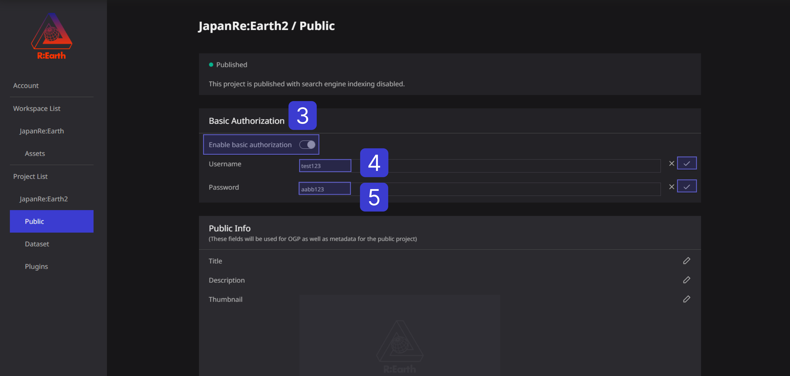

# Basic Authorization

## Public Settings

Public settings allow you to set parameters that affect the published project.

.png)

**A** . **Public status** : allows you to check the current public status of your project.

**B** . **Basic Authorization :** supports adding basic user and password login to your project.

**C** . **Public Info** : is the basic project information that will be seen publicly(OGP included). 

**D** . **Site settings** : allow you to change the domain of the project. The sub-domain of Re:Earth is used by default, or you can use a custom domain. 

## **Basic Authorization**

Basic authentication is one of the methods for restricting access to web pages protected by the HTTP protocol.

With basic authentication enabled, users without a specific **username and password** will not be able to view webpages.

On the other hand, disabling basic authentication allows anyone to access the webpage.

- **The default setting for basic authentication is disabled. **
- *Only if you want to enable it as necessary, please follow the steps below to set it. **

(1) Click the setting button of the corresponding project in the workspace.

(2) Click Public settings.

③Turn on basic authentication.

④ Enter the user name in half-width alphanumeric characters and click the ✓ mark on the right.

⑤ Enter the password in half-width alphanumeric characters. Click the ✓ mark on the right.

