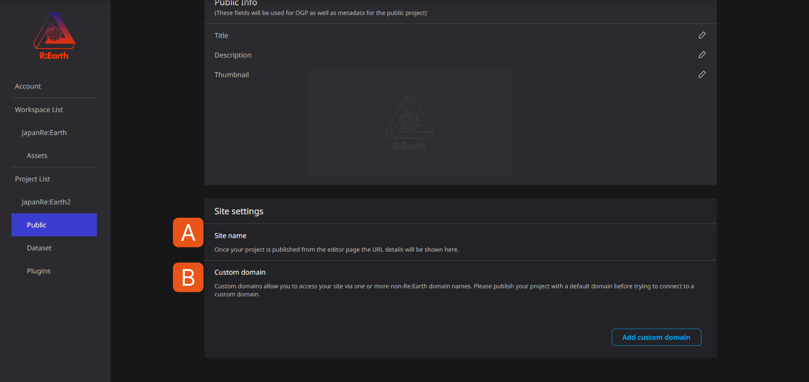
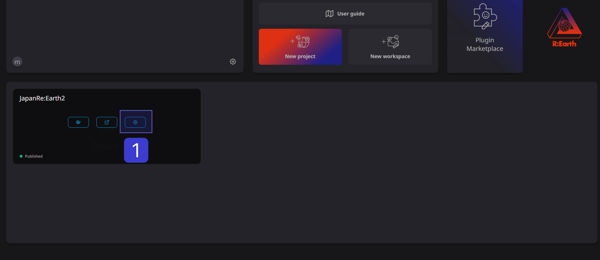
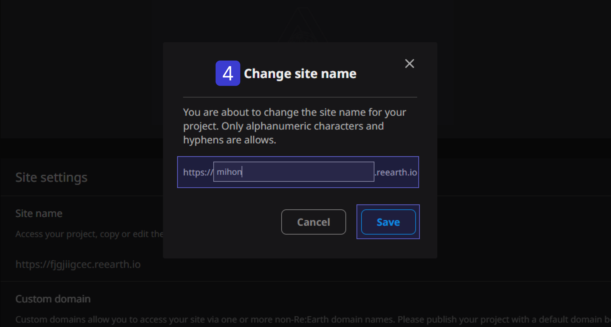
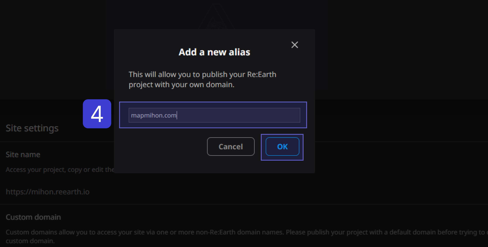

# Subdomains and Custom domains

Re: Earth allows you to set up subdomains and custom domains.

**A** . You can set a subdomain from the site name.

For example, if there is a domain "[example.com](http://example.com/)", then "[blog.example.com](http://blog.example.com/)"

or "[shop.example.com](http://shop.example.com/)".

In this way, subdomains distinguish different sites or services and within the same domain

Used to serve different content.

**B** . Custom domains are only available for paid users**. **

Obtain a domain externally and set the obtained domain from Re: Earth's add domain function

Is possible. **After setting, it may take a few days to reflect, and it will not be reflected automatically, so**

- *You need to check and press the update button from time to time. **

## About subdomain settings

(1) Click the setting button of the corresponding project in the workspace.

(2) Click Public Settings.

.png)

③Click the edit button of the site name in the site settings.

.png)

④The screen to change the site name will be displayed.

Enter the displayed site name in the box and click Save.

Only alphabets and hyphens (-) are allowed in the site name.

Example: mihon

⑤ Then, the site name will be changed like this.

Subdomain settings are above.

### About custom domain settings (from here onwards only for paying users)

(1) Click the setting button of the corresponding project in the workspace.

.png)

(2) Click Public Settings.

%201.png)

③ Click Add custom domain in Custom Domains

.png)

④ A box called Add Alias is output, so obtain the domain externally and

After entering the domain into the box, click the Confirm button.

Example: [mapmihon.com](http://mapmihon.com/)

After setting, it may take several days to reflect, and it will not be reflected automatically

Confirm this custom domain setting screen from time to time, and it will be output on the custom domain setting screen

Your custom domain settings are now complete.

Example: [mapmihon.com](http://mapmihon.com/)