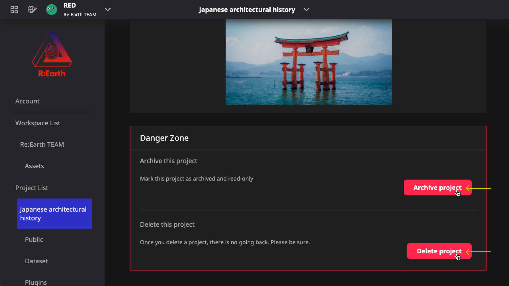

# Create, delete and archive
------

## Create a new project

There are two ways to create a new project.

- One is from Dashboard.

  **Dashboard** > **Quick Start** > `New project button` > **Fill modal**

  

- Another way is from editor page.

  **Editor** > **Header menu** > `Manage projects` > **Project list page** > `New project` > **Fill modal**

  

  

### Create new project modal

The last step of creating a new project is to fill in the initial information of the project, you will see the following modal form.

  

  1
  <strong>Project Name</strong> is the place where you can write the name of your project.

  2
  <strong>Description</strong> is the place where you can write the introduction of your project, in order to facilitate management when the number of projects is large.

  3
  <strong>Thumbnail image</strong> will be used inside the platform as the main visual image of your project.

  4
  After completing the steps above 👆, click the Create button.

  

:::caution

Now these project settings will only be displayed inside Re:Earth. When publishing the project, we can specifically set the project information and OGP for publishing. For more information about the release, please check here

:::

## Delete and Archive your project

When you find that you don't need one project, you can delete it completely, or you can archive it from **project seeting** page.

:::caution

or Re:Earth, deleting an project means completely removing all information and data about the project. This is an operation that can no longer be undone or returned, so please use this operation carefully.

:::

:::info

The archive operation will not delete the project data, but will only turn it into read-only mode. When you want to modify the project again, just remove the project from the archive mode.

:::

### Enter the project settings page:

- From Dashboard

  **Dashboard** —> **Project Card** —> `⚙️ Button`

  

- Or you can enter the settings page on the Editor page.

  **Editor** —> **Header project menu** —> `Project Settings Button`

  

### Danger Zone

At the bottom of the project settings page, you can find Danger Zone, where you can archive and delete your project.

  

## Archived status and release

Once the project is archived, you will not be able to find it on the Dashboard page. But you can find it on the Project list page.

**Setting page** —> **Project list page** —> **Archived project**

  

Enter the settings page and find that the project has been locked and cannot be modified.

  

If you want to edit the project again, just unlock the archive status first.

  

